# PizzaFast - Gestión de Pizzería Online

## 👥 Miembros del Equipo

| Nombre y Apellidos | Correo URJC | Usuario GitHub |
|:--- |:--- |:--- |
| Alejandro Rico González | a.rico.2022@alumnos.urjc.es | ALEJANDR0-RIC0 |
| David Esteban Bernardo | d.estebanb.2022@alumnos.urjc.es | Daviid24x |
| Gaizka Aranbarri Berasaluze | g.aranbarri.2022@alumnos.urjc.es | GaizkArNF |
| Mario Aparisi Castro | m.aparisi.2022@alumnos.urjc.es | Aparisi02 |

---

## 🎭 Preparación 1: Definición del Proyecto

### Descripción de la web
**PizzaFast** es una aplicación web de comercio electrónico diseñada para una pizzería. Su objetivo es permitir a los clientes consultar la carta de productos, realizar pedidos online y gestionar su historial de compras. Para los administradores, la herramienta ofrece un control total sobre el catálogo de productos (pizzas, bebidas, postres) y herramientas de análisis de ventas. La aplicación busca simplificar el flujo de venta de comida a domicilio eliminando la gestión telefónica.

### Entidades
La aplicación gestionará las siguientes **4 entidades** principales:

1. **Usuario**: Representa a las personas que interactúan con el sistema (clientes sin registrar, clientes registrados y administradores).
2. **Producto**: Representa los artículos disponibles para la venta (Pizzas, Bebidas, Postres).
3. **Pedido**: Representa la transacción de compra finalizada.
4. **Categoría**: Clasificación para organizar los productos del menú.

**Relaciones entre entidades:**
* **Usuario - Pedido (1:N)**: Un usuario puede realizar múltiples pedidos a lo largo del tiempo, pero un pedido pertenece a un único usuario.
* **Pedido - Producto (N:M)**: Un pedido contiene varios productos, y un mismo producto puede aparecer en muchos pedidos distintos.
* **Producto - Categoría (N:1)**: Un producto pertenece a una única categoría (ej. "Pizzas Clásicas"), pero una categoría agrupa múltiples productos.

### Permisos de los usuarios
La aplicación distingue tres roles con permisos específicos y propiedad sobre los datos:

* **Usuario Anónimo**:
    * **Permisos**: Puede visualizar el catálogo de productos, filtrar por categorías, ver detalles de las pizzas y acceder a las pantallas de login y registro.
    * **Propiedad**: No es dueño de ninguna entidad.

* **Usuario Registrado**:
    * **Permisos**: Tiene todos los permisos del usuario anónimo. Además, puede realizar pedidos, editar su perfil y que le lleguen las facturas al correo.
    * **Propiedad**: Es dueño de sus datos de **Usuario** (perfil) y de los **Pedidos** que ha realizado.

* **Administrador**:
    * **Permisos**: Tiene control total sobre la aplicación. Puede dar de alta/baja productos y categorías, ver todos los pedidos de la tienda y acceder a gráficas de ventas.
    * **Propiedad**: Gestiona todas las entidades, siendo el responsable de **Productos** y **Categorías**.

### Imágenes
La aplicación permitirá la subida y visualización de imágenes para las siguientes entidades:
* **Categoría**: Cada categoría tendrá una foto representativa sobre el tipo de producto que represente. Por ejemplo: bebidas, que salga una lata.
* **Producto**: Cada pizza o producto tendrá una imagen ilustrativa en la carta.

### Gráficos
Se implementará un panel de estadísticas para el administrador con los siguientes gráficos:
* **Top Ventas**: Mostrará los 5 productos más vendidos para que los usuarios los vean en una tabla.
* **Top ventas (grafico de barras)**: Mostrará en un gráfico de barras las ventas de los productos a los administradores para ver cuales son los mas vendidos.

### Tecnología complementaria
Se utilizará un servicio de **envío de correos electrónicos** .
* **Funcionalidad**: Al finalizar una compra correctamente, el sistema enviará automáticamente un correo electrónico al usuario registrado. Este correo contendrá la confirmación del pedido y un resumen con los productos adquiridos y el importe total.
* **Tecnología**: Se utilizará la librería `JavaMailSender` (Spring Boot Starter Mail).

### Algoritmo o consulta avanzada
La aplicación implementará un **Sistema de Recomendaciones Personalizado** en el listado de productos.
* **Descripción**: La aplicación altera dinámicamente el orden de recomendaciones según el comportamiento del usuario registrado, combinando su último pedido con su historial completo de compras.
* **Funcionamiento**: Al cargar la home, el algoritmo toma el último pedido del usuario, elimina duplicados y ordena esos productos por puntos (cantidad en el último pedido, después frecuencia histórica y por último desempate estable por id). Si ya hay 5 productos, devuelve esos 5. Si hay menos de 5, rellena con productos del catálogo priorizando categorías detectadas en el último pedido (si hay pizzas: pizzas -> entrantes -> bebidas; si no hay pizzas pero hay entrantes: entrantes -> pizzas -> bebidas; si solo hay bebidas: bebidas -> pizzas -> entrantes). Si aún faltan huecos, completa con el resto por orden histórico. El sistema admite relleno con productos de 0 puntos para poder llegar a 5 recomendaciones siempre que el catálogo tenga suficientes productos.

---

## 🛠 **Preparación 2: Maquetación de páginas con HTML y CSS**

### **Vídeo de Demostración**
📹 **[Enlace al vídeo en YouTube](https://youtu.be/mbFzGGHQyUs)**
> Vídeo mostrando las principales funcionalidades de la aplicación web.

### **Diagrama de Navegación**
Diagrama que muestra cómo se navega entre las diferentes páginas de la aplicación:


> [Descripción breve: El diagrama resume la navegacion principal desde la pagina de inicio hacia el catalogo y los detalles de producto, con acceso al carrito segun el rol del usuario. Las pantallas de autenticacion estan siempre disponibles y el administrador dispone de vistas de gestion adicionales.]

### **Capturas de Pantalla y Descripción de Páginas**

#### **1. Página Principal / Home**


> [Descripción breve: "Página de inicio que muestra los productos destacados, categorías principales y un banner promocional. Incluye barra de navegación y acceso a registro/login para usuarios no autenticados aun."]

#### **2. Menú**
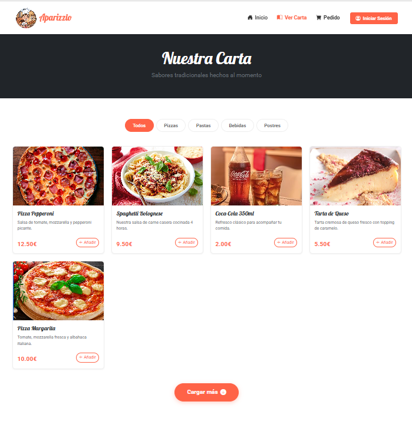

> [Descripción breve: "Listado completo del catálogo con filtros por categoría, precios visibles y tarjetas de producto. Permite entrar al detalle de cada pizza y añadirla rápidamente al carrito."]

#### **3. Categoría**
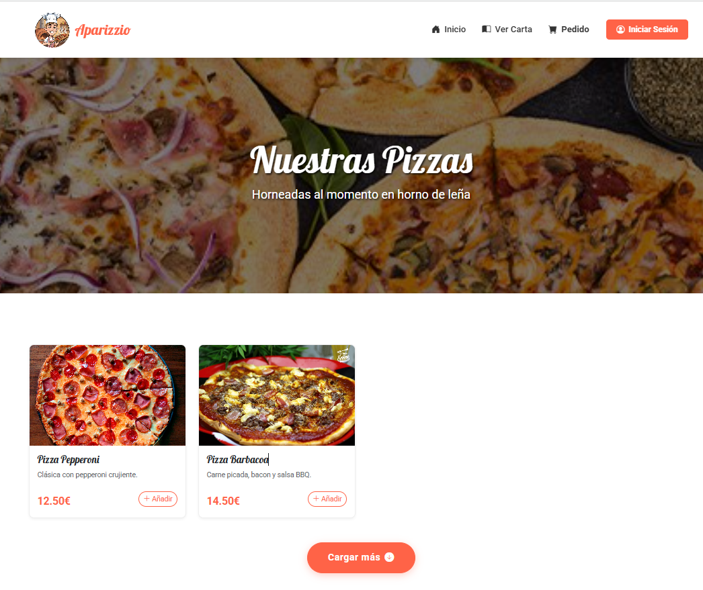

> [Descripción breve: "Vista filtrada por una categoría concreta donde se muestran solo los productos relacionados. Incluye nombre, imagen, precio y accesos directos al detalle."]

#### **4. Producto**


> [Descripción breve: "Página de detalle con imagen ampliada, descripción completa, ingredientes destacados y precio final. Ofrece acciones para elegir cantidad y añadir al carrito."]

#### **5. Carrito**


> [Descripción breve: "Resumen del pedido con productos añadidos, cantidades editables y subtotal por línea. Muestra el total final y la acción para continuar con el pago o finalizar la compra."]

#### **6. Admin - Usuarios**
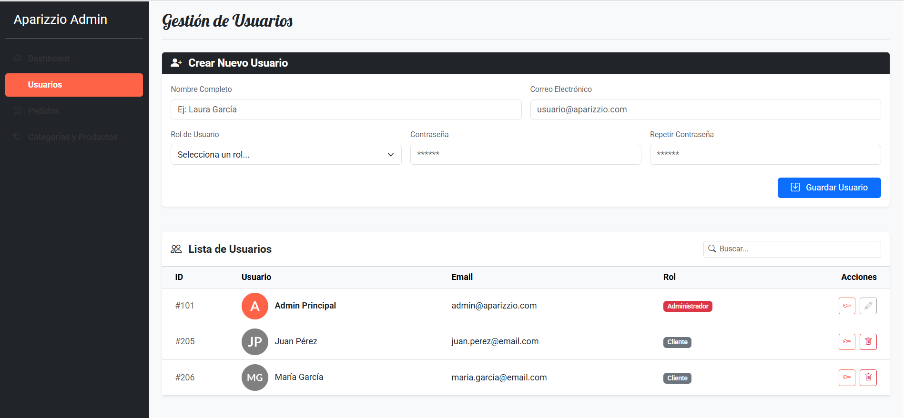

> [Descripción breve: "Panel de administración para visualizar el listado de usuarios con su rol y estado. Permite gestionar altas, bajas o cambios de permisos desde una tabla central."]

#### **7. Admin - Pedidos**
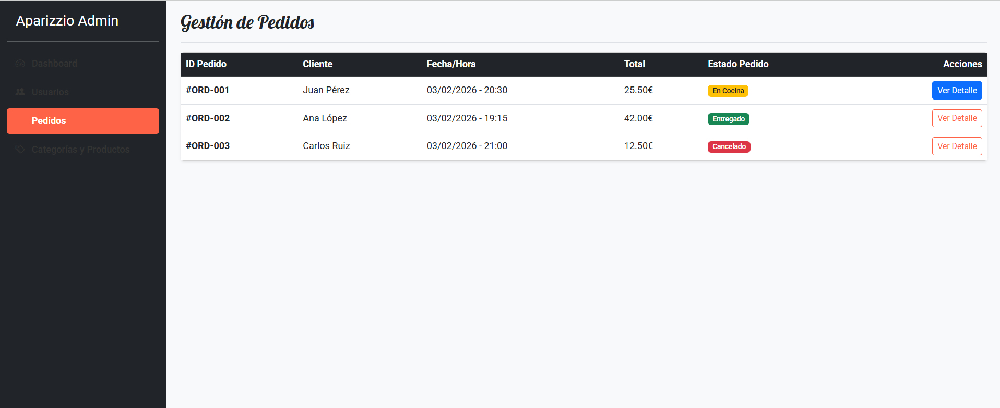

> [Descripción breve: "Gestión de pedidos mostrando estado, fecha e importe. Ofrece acceso al detalle de cada compra y opciones para actualizar el estado del pedido."]

#### **8. Admin - Categorías**
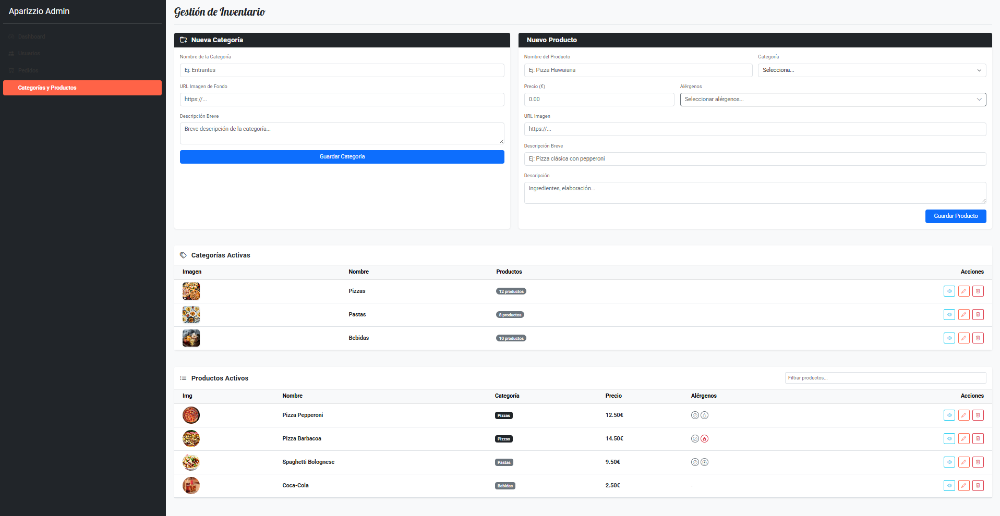

> [Descripción breve: "Administración de categorías con listado actual y acciones de crear, editar o eliminar. Facilita organizar el catálogo por tipos de producto."]

#### **9. Admin - Métricas**


> [Descripción breve: "Panel de métricas con gráficos de ventas, productos más solicitados y comparativas básicas. Ayuda a detectar tendencias y rendimiento del catálogo."]

---

## 🛠 **Práctica 1: Web con HTML generado en servidor y AJAX**

### **Vídeo de Demostración**
📹 **[Enlace al vídeo en YouTube](https://www.youtube.com/watch?v=x91MPoITQ3I)**
> Vídeo mostrando las principales funcionalidades de la aplicación web.

### **Navegación y Capturas de Pantalla**

#### **Diagrama de Navegación**

Solo si ha cambiado.

#### **Capturas de Pantalla Actualizadas**

#### **1. Página Principal / Home - CAMBIA PARA USERS CON PEDIDOS**
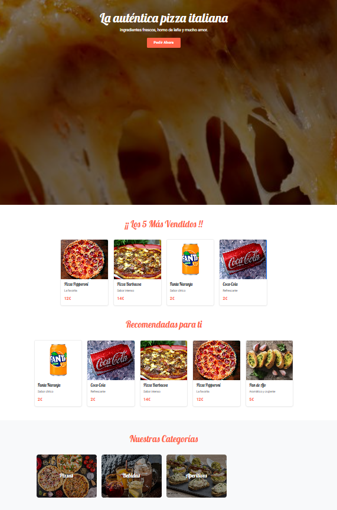

> [Descripción breve: "Página de inicio que muestra los productos destacados, categorías principales y un banner promocional. Incluye barra de navegación y acceso a registro/login para usuarios no autenticados aun."]

#### **2. Menú - CAMBIA EL FILTRO**
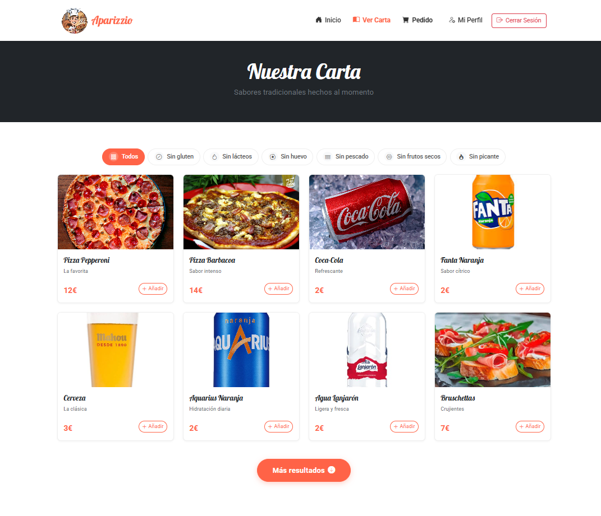

> [Descripción breve: "Listado completo del catálogo con filtros por categoría, precios visibles y tarjetas de producto. Permite entrar al detalle de cada pizza y añadirla rápidamente al carrito."]

#### **3. Categoría - NO CAMBIA**


> [Descripción breve: "Vista filtrada por una categoría concreta donde se muestran solo los productos relacionados. Incluye nombre, imagen, precio y accesos directos al detalle."]

#### **4. Producto - NO CAMBIA**


> [Descripción breve: "Página de detalle con imagen ampliada, descripción completa, ingredientes destacados y precio final. Ofrece acciones para elegir cantidad y añadir al carrito."]

#### **5. Carrito - NO CAMBIA**


> [Descripción breve: "Resumen del pedido con productos añadidos, cantidades editables y subtotal por línea. Muestra el total final y la acción para continuar con el pago o finalizar la compra."]

#### **6. Admin - Usuarios CONTRASEÑA**
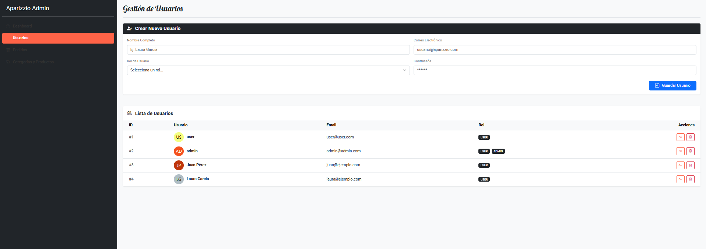

> [Descripción breve: "Panel de administración para visualizar el listado de usuarios con su rol y estado. Permite gestionar altas, bajas o cambios de permisos desde una tabla central."]

#### **7. Admin - Pedidos**


> [Descripción breve: "Gestión de pedidos mostrando estado, fecha e importe. Ofrece acceso al detalle de cada compra y opciones para actualizar el estado del pedido."]

#### **8. Admin - Categorías**
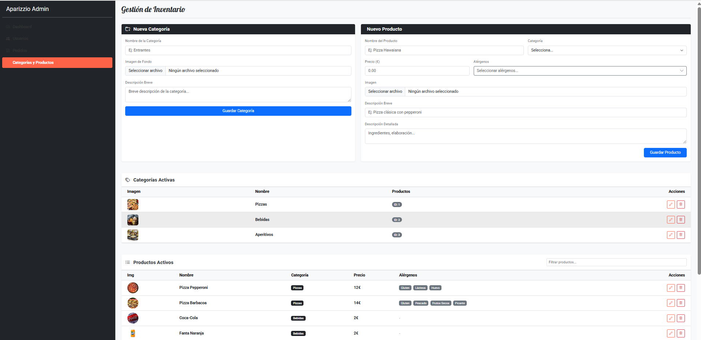

> [Descripción breve: "Administración de categorías con listado actual y acciones de crear, editar o eliminar. Facilita organizar el catálogo por tipos de producto."]

#### **9. Admin - Métricas - NO CAMBIA**


> [Descripción breve: "Panel de métricas con gráficos de ventas, productos más solicitados y comparativas básicas. Ayuda a detectar tendencias y rendimiento del catálogo."]

#### **10. Profile NUEVO**
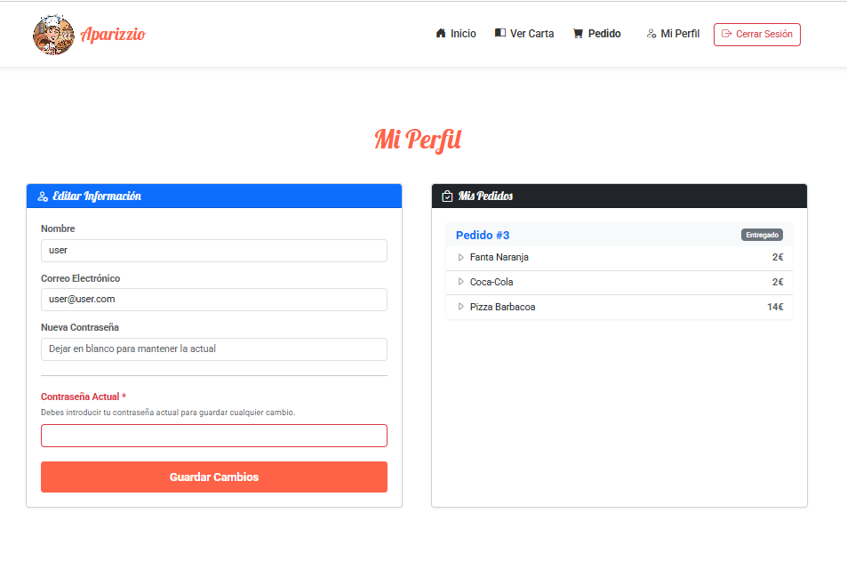

> [Descripción breve: "Pantalla de perfil del usuario con su información y opciones de gestión de cuenta."]

### **Instrucciones de Ejecución**

#### **Requisitos Previos**
- **Java**: versión 21 o superior
- **Maven**: versión 3.8 o superior
- **MySQL**: versión 8.0 o superior
- **Git**: para clonar el repositorio

#### **Pasos para ejecutar la aplicación**

1. **Clonar el repositorio**
   ```bash
   git clone https://github.com/[usuario]/[nombre-repositorio].git
   cd [nombre-repositorio]
   ```

2. **AQUÍ INDICAR LO SIGUIENTES PASOS**

#### **Credenciales de prueba**
- **Usuario Admin**: usuario: `admin@admin.com`, contraseña: `admin`
- **Usuario Registrado**: usuario: `user@user.com`, contraseña: `user`

### **Diagrama de Entidades de Base de Datos**

Diagrama mostrando las entidades, sus campos y relaciones:

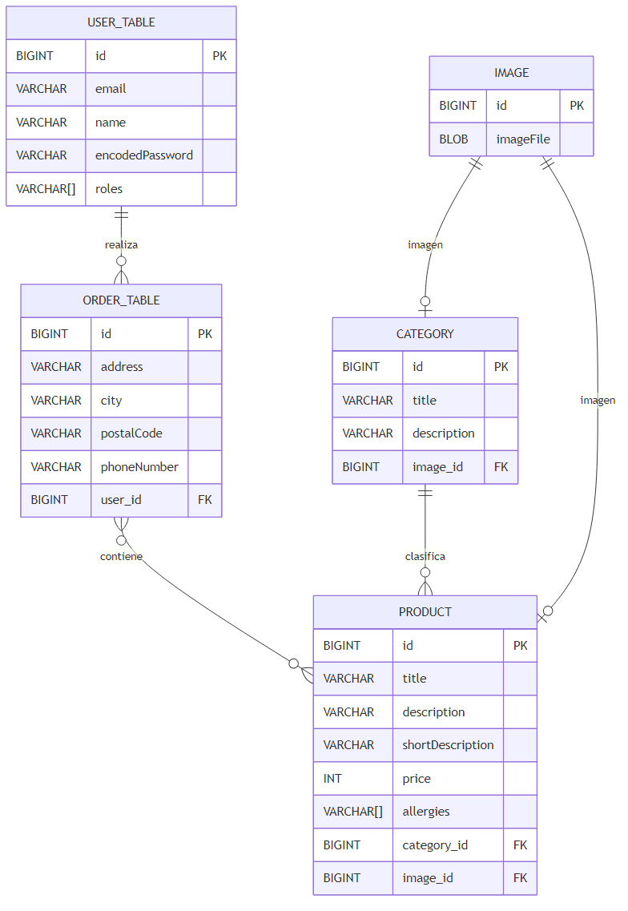

> [Descripción opcional: Ej: "El diagrama muestra las 4 entidades principales: Usuario, Producto, Pedido y Categoría, con sus respectivos atributos y relaciones 1:N y N:M."]

### **Diagrama de Clases y Templates**

Diagrama de clases de la aplicación con diferenciación por colores o secciones:


> [Descripción opcional del diagrama y relaciones principales]

### **Participación de Miembros en la Práctica 1**

#### **Alumno 1 - [Nombre Completo]**

[Descripción de las tareas y responsabilidades principales del alumno en el proyecto]

| Nº    | Commits      | Files      |
|:------------: |:------------:| :------------:|
|1| [Descripción commit 1](URL_commit_1)  | [Archivo1](URL_archivo_1)   |
|2| [Descripción commit 2](URL_commit_2)  | [Archivo2](URL_archivo_2)   |
|3| [Descripción commit 3](URL_commit_3)  | [Archivo3](URL_archivo_3)   |
|4| [Descripción commit 4](URL_commit_4)  | [Archivo4](URL_archivo_4)   |
|5| [Descripción commit 5](URL_commit_5)  | [Archivo5](URL_archivo_5)   |

---

#### **Alumno 2 - [Nombre Completo]**

[Descripción de las tareas y responsabilidades principales del alumno en el proyecto]

| Nº    | Commits      | Files      |
|:------------: |:------------:| :------------:|
|1| [Descripción commit 1](URL_commit_1)  | [Archivo1](URL_archivo_1)   |
|2| [Descripción commit 2](URL_commit_2)  | [Archivo2](URL_archivo_2)   |
|3| [Descripción commit 3](URL_commit_3)  | [Archivo3](URL_archivo_3)   |
|4| [Descripción commit 4](URL_commit_4)  | [Archivo4](URL_archivo_4)   |
|5| [Descripción commit 5](URL_commit_5)  | [Archivo5](URL_archivo_5)   |

---

#### **Alumno 3 - [Nombre Completo]**

[Descripción de las tareas y responsabilidades principales del alumno en el proyecto]

| Nº    | Commits      | Files      |
|:------------: |:------------:| :------------:|
|1| [Descripción commit 1](URL_commit_1)  | [Archivo1](URL_archivo_1)   |
|2| [Descripción commit 2](URL_commit_2)  | [Archivo2](URL_archivo_2)   |
|3| [Descripción commit 3](URL_commit_3)  | [Archivo3](URL_archivo_3)   |
|4| [Descripción commit 4](URL_commit_4)  | [Archivo4](URL_archivo_4)   |
|5| [Descripción commit 5](URL_commit_5)  | [Archivo5](URL_archivo_5)   |

---

#### **Alumno 4 - [Nombre Completo]**

[Descripción de las tareas y responsabilidades principales del alumno en el proyecto]

| Nº    | Commits      | Files      |
|:------------: |:------------:| :------------:|
|1| [Descripción commit 1](URL_commit_1)  | [Archivo1](URL_archivo_1)   |
|2| [Descripción commit 2](URL_commit_2)  | [Archivo2](URL_archivo_2)   |
|3| [Descripción commit 3](URL_commit_3)  | [Archivo3](URL_archivo_3)   |
|4| [Descripción commit 4](URL_commit_4)  | [Archivo4](URL_archivo_4)   |
|5| [Descripción commit 5](URL_commit_5)  | [Archivo5](URL_archivo_5)   |

---

## 🛠 **Práctica 2: Incorporación de una API REST a la aplicación web, despliegue con Docker y despliegue remoto**

### **Vídeo de Demostración**
📹 **[Enlace al vídeo en YouTube](https://www.youtube.com/watch?v=x91MPoITQ3I)**
> Vídeo mostrando las principales funcionalidades de la aplicación web.

### **Documentación de la API REST**

#### **Especificación OpenAPI**
📄 **[Especificación OpenAPI (YAML)](/api-docs/api-docs.yaml)**

#### **Documentación HTML**
📖 **[Documentación API REST (HTML)](https://raw.githack.com/[usuario]/[repositorio]/main/api-docs/api-docs.html)**

> La documentación de la API REST se encuentra en la carpeta `/api-docs` del repositorio. Se ha generado automáticamente con SpringDoc a partir de las anotaciones en el código Java.

### **Diagrama de Clases y Templates Actualizado**

Diagrama actualizado incluyendo los @RestController y su relación con los @Service compartidos:


### **Instrucciones de Ejecución con Docker**

#### **Requisitos previos:**
- Docker instalado (versión 20.10 o superior)
- Docker Compose instalado (versión 2.0 o superior)

#### **Pasos para ejecutar con docker-compose:**

1. **Clonar el repositorio** (si no lo has hecho ya):
   ```bash
   git clone https://github.com/[usuario]/[repositorio].git
   cd [repositorio]
   ```

2. **AQUÍ LOS SIGUIENTES PASOS**:

### **Construcción de la Imagen Docker**

#### **Requisitos:**
- Docker instalado en el sistema

#### **Pasos para construir y publicar la imagen:**

1. **Navegar al directorio de Docker**:
   ```bash
   cd docker
   ```

2. **AQUÍ LOS SIGUIENTES PASOS**

### **Despliegue en Máquina Virtual**

#### **Requisitos:**
- Acceso a la máquina virtual (SSH)
- Clave privada para autenticación
- Conexión a la red correspondiente o VPN configurada

#### **Pasos para desplegar:**

1. **Conectar a la máquina virtual**:
   ```bash
   ssh -i [ruta/a/clave.key] [usuario]@[IP-o-dominio-VM]
   ```
   
   Ejemplo:
   ```bash
   ssh -i ssh-keys/app.key vmuser@10.100.139.XXX
   ```

2. **AQUÍ LOS SIGUIENTES PASOS**:

### **URL de la Aplicación Desplegada**

🌐 **URL de acceso**: `https://[nombre-app].etsii.urjc.es:8443`

#### **Credenciales de Usuarios de Ejemplo**

| Rol | Usuario | Contraseña |
|:---|:---|:---|
| Administrador | admin | admin123 |
| Usuario Registrado | user1 | user123 |
| Usuario Registrado | user2 | user123 |

### **Participación de Miembros en la Práctica 2**

#### **Alumno 1 - [Nombre Completo]**

[Descripción de las tareas y responsabilidades principales del alumno en el proyecto]

| Nº    | Commits      | Files      |
|:------------: |:------------:| :------------:|
|1| [Descripción commit 1](URL_commit_1)  | [Archivo1](URL_archivo_1)   |
|2| [Descripción commit 2](URL_commit_2)  | [Archivo2](URL_archivo_2)   |
|3| [Descripción commit 3](URL_commit_3)  | [Archivo3](URL_archivo_3)   |
|4| [Descripción commit 4](URL_commit_4)  | [Archivo4](URL_archivo_4)   |
|5| [Descripción commit 5](URL_commit_5)  | [Archivo5](URL_archivo_5)   |

---

#### **Alumno 2 - [Nombre Completo]**

[Descripción de las tareas y responsabilidades principales del alumno en el proyecto]

| Nº    | Commits      | Files      |
|:------------: |:------------:| :------------:|
|1| [Descripción commit 1](URL_commit_1)  | [Archivo1](URL_archivo_1)   |
|2| [Descripción commit 2](URL_commit_2)  | [Archivo2](URL_archivo_2)   |
|3| [Descripción commit 3](URL_commit_3)  | [Archivo3](URL_archivo_3)   |
|4| [Descripción commit 4](URL_commit_4)  | [Archivo4](URL_archivo_4)   |
|5| [Descripción commit 5](URL_commit_5)  | [Archivo5](URL_archivo_5)   |

---

#### **Alumno 3 - [Nombre Completo]**

[Descripción de las tareas y responsabilidades principales del alumno en el proyecto]

| Nº    | Commits      | Files      |
|:------------: |:------------:| :------------:|
|1| [Descripción commit 1](URL_commit_1)  | [Archivo1](URL_archivo_1)   |
|2| [Descripción commit 2](URL_commit_2)  | [Archivo2](URL_archivo_2)   |
|3| [Descripción commit 3](URL_commit_3)  | [Archivo3](URL_archivo_3)   |
|4| [Descripción commit 4](URL_commit_4)  | [Archivo4](URL_archivo_4)   |
|5| [Descripción commit 5](URL_commit_5)  | [Archivo5](URL_archivo_5)   |

---

#### **Alumno 4 - [Nombre Completo]**

[Descripción de las tareas y responsabilidades principales del alumno en el proyecto]

| Nº    | Commits      | Files      |
|:------------: |:------------:| :------------:|
|1| [Descripción commit 1](URL_commit_1)  | [Archivo1](URL_archivo_1)   |
|2| [Descripción commit 2](URL_commit_2)  | [Archivo2](URL_archivo_2)   |
|3| [Descripción commit 3](URL_commit_3)  | [Archivo3](URL_archivo_3)   |
|4| [Descripción commit 4](URL_commit_4)  | [Archivo4](URL_archivo_4)   |
|5| [Descripción commit 5](URL_commit_5)  | [Archivo5](URL_archivo_5)   |

---

## 🛠 **Práctica 3: Implementación de la web con arquitectura SPA**

### **Vídeo de Demostración**
📹 **[Enlace al vídeo en YouTube](URL_del_video)**
> Vídeo mostrando las principales funcionalidades de la aplicación web.

### **Preparación del Entorno de Desarrollo**

#### **Requisitos Previos**
- **Node.js**: versión 18.x o superior
- **npm**: versión 9.x o superior (se instala con Node.js)
- **Git**: para clonar el repositorio

#### **Pasos para configurar el entorno de desarrollo**

1. **Instalar Node.js y npm**
   
   Descarga e instala Node.js desde [https://nodejs.org/](https://nodejs.org/)
   
   Verifica la instalación:
   ```bash
   node --version
   npm --version
   ```

2. **Clonar el repositorio** (si no lo has hecho ya)
   ```bash
   git clone https://github.com/[usuario]/[nombre-repositorio].git
   cd [nombre-repositorio]
   ```

3. **Navegar a la carpeta del proyecto React**
   ```bash
   cd frontend
   ```

4. **AQUÍ LOS SIGUIENTES PASOS**

### **Diagrama de Clases y Templates de la SPA**

Diagrama mostrando los componentes React, hooks personalizados, servicios y sus relaciones:


### **Participación de Miembros en la Práctica 3**

#### **Alumno 1 - [Nombre Completo]**

[Descripción de las tareas y responsabilidades principales del alumno en el proyecto]

| Nº    | Commits      | Files      |
|:------------: |:------------:| :------------:|
|1| [Descripción commit 1](URL_commit_1)  | [Archivo1](URL_archivo_1)   |
|2| [Descripción commit 2](URL_commit_2)  | [Archivo2](URL_archivo_2)   |
|3| [Descripción commit 3](URL_commit_3)  | [Archivo3](URL_archivo_3)   |
|4| [Descripción commit 4](URL_commit_4)  | [Archivo4](URL_archivo_4)   |
|5| [Descripción commit 5](URL_commit_5)  | [Archivo5](URL_archivo_5)   |

---

#### **Alumno 2 - [Nombre Completo]**

[Descripción de las tareas y responsabilidades principales del alumno en el proyecto]

| Nº    | Commits      | Files      |
|:------------: |:------------:| :------------:|
|1| [Descripción commit 1](URL_commit_1)  | [Archivo1](URL_archivo_1)   |
|2| [Descripción commit 2](URL_commit_2)  | [Archivo2](URL_archivo_2)   |
|3| [Descripción commit 3](URL_commit_3)  | [Archivo3](URL_archivo_3)   |
|4| [Descripción commit 4](URL_commit_4)  | [Archivo4](URL_archivo_4)   |
|5| [Descripción commit 5](URL_commit_5)  | [Archivo5](URL_archivo_5)   |

---

#### **Alumno 3 - [Nombre Completo]**

[Descripción de las tareas y responsabilidades principales del alumno en el proyecto]

| Nº    | Commits      | Files      |
|:------------: |:------------:| :------------:|
|1| [Descripción commit 1](URL_commit_1)  | [Archivo1](URL_archivo_1)   |
|2| [Descripción commit 2](URL_commit_2)  | [Archivo2](URL_archivo_2)   |
|3| [Descripción commit 3](URL_commit_3)  | [Archivo3](URL_archivo_3)   |
|4| [Descripción commit 4](URL_commit_4)  | [Archivo4](URL_archivo_4)   |
|5| [Descripción commit 5](URL_commit_5)  | [Archivo5](URL_archivo_5)   |

---

#### **Alumno 4 - [Nombre Completo]**

[Descripción de las tareas y responsabilidades principales del alumno en el proyecto]

| Nº    | Commits      | Files      |
|:------------: |:------------:| :------------:|
|1| [Descripción commit 1](URL_commit_1)  | [Archivo1](URL_archivo_1)   |
|2| [Descripción commit 2](URL_commit_2)  | [Archivo2](URL_archivo_2)   |
|3| [Descripción commit 3](URL_commit_3)  | [Archivo3](URL_archivo_3)   |
|4| [Descripción commit 4](URL_commit_4)  | [Archivo4](URL_archivo_4)   |
|5| [Descripción commit 5](URL_commit_5)  | [Archivo5](URL_archivo_5)   |

