# PizzaFast - Gestión de Pizzería Online

## 👥 Miembros del Equipo

| Nombre y Apellidos | Correo URJC | Usuario GitHub |
|:--- |:--- |:--- |
| Alejandro Rico González | a.rico.2022@alumnos.urjc.es | ALEJANDR0-RIC0 |
| David Esteban Bernardo | d.estebanb.2022@alumnos.urjc.es | Daviid24x |
| Gaizka Aranbarri Berasaluze | g.aranbarri.2022@alumnos.urjc.es | GaizkArNF |
| Mario Aparisi Castro | m.aparisi.2022@alumnos.urjc.es | Aparisi02 |

---

## 🎭 Preparación 1: Definición del Proyecto

### Descripción de la web
**PizzaFast** es una aplicación web de comercio electrónico diseñada para una pizzería. Su objetivo es permitir a los clientes consultar la carta de productos, realizar pedidos online y gestionar su historial de compras. Para los administradores, la herramienta ofrece un control total sobre el catálogo de productos (pizzas, bebidas, postres) y herramientas de análisis de ventas. La aplicación busca simplificar el flujo de venta de comida a domicilio eliminando la gestión telefónica.

### Entidades
La aplicación gestionará las siguientes **4 entidades** principales:

1. **Usuario**: Representa a las personas que interactúan con el sistema (clientes sin registrar, clientes registrados y administradores).
2. **Producto**: Representa los artículos disponibles para la venta (Pizzas, Bebidas, Postres).
3. **Pedido**: Representa la transacción de compra finalizada.
4. **Categoría**: Clasificación para organizar los productos del menú.

**Relaciones entre entidades:**
* **Usuario - Pedido (1:N)**: Un usuario puede realizar múltiples pedidos a lo largo del tiempo, pero un pedido pertenece a un único usuario.
* **Pedido - Producto (N:M)**: Un pedido contiene varios productos, y un mismo producto puede aparecer en muchos pedidos distintos.
* **Producto - Categoría (N:1)**: Un producto pertenece a una única categoría (ej. "Pizzas Clásicas"), pero una categoría agrupa múltiples productos.

### Permisos de los usuarios
La aplicación distingue tres roles con permisos específicos y propiedad sobre los datos:

* **Usuario Anónimo**:
    * **Permisos**: Puede visualizar el catálogo de productos, filtrar por categorías, ver detalles de las pizzas y acceder a las pantallas de login y registro.
    * **Propiedad**: No es dueño de ninguna entidad.

* **Usuario Registrado**:
    * **Permisos**: Tiene todos los permisos del usuario anónimo. Además, puede realizar pedidos, editar su perfil y que le lleguen las facturas al correo.
    * **Propiedad**: Es dueño de sus datos de **Usuario** (perfil) y de los **Pedidos** que ha realizado.

* **Administrador**:
    * **Permisos**: Tiene control total sobre la aplicación. Puede dar de alta/baja productos y categorías, ver todos los pedidos de la tienda y acceder a gráficas de ventas.
    * **Propiedad**: Gestiona todas las entidades, siendo el responsable de **Productos** y **Categorías**.

### Imágenes
La aplicación permitirá la subida y visualización de imágenes para las siguientes entidades:
* **Categoría**: Cada categoría tendrá una foto representativa sobre el tipo de producto que represente. Por ejemplo: bebidas, que salga una lata.
* **Producto**: Cada pizza o producto tendrá una imagen ilustrativa en la carta.

### Gráficos
Se implementará un panel de estadísticas para el administrador con los siguientes gráficos:
* **Top Ventas**: Mostrará los 5 productos más vendidos para que los usuarios los vean en una tabla.
* **Top ventas (grafico de barras)**: Mostrará en un gráfico de barras las ventas de los productos a los administradores para ver cuales son los mas vendidos.

### Tecnología complementaria
Se utilizará un servicio de **envío de correos electrónicos** .
* **Funcionalidad**: Al finalizar una compra correctamente, el sistema enviará automáticamente un correo electrónico al usuario registrado. Este correo contendrá la confirmación del pedido y un resumen con los productos adquiridos y el importe total.
* **Tecnología**: Se utilizará la librería `JavaMailSender` (Spring Boot Starter Mail).

### Algoritmo o consulta avanzada
La aplicación implementará un **Sistema de Recomendaciones Personalizado** en el listado de productos.
* **Descripción**: La aplicación altera dinámicamente el orden de recomendaciones según el comportamiento del usuario registrado, combinando su último pedido con su historial completo de compras.
* **Funcionamiento**: Al cargar la home, el algoritmo toma el último pedido del usuario, elimina duplicados y ordena esos productos por puntos (cantidad en el último pedido, después frecuencia histórica y por último desempate estable por id). Si ya hay 5 productos, devuelve esos 5. Si hay menos de 5, rellena con productos del catálogo priorizando categorías detectadas en el último pedido (si hay pizzas: pizzas -> entrantes -> bebidas; si no hay pizzas pero hay entrantes: entrantes -> pizzas -> bebidas; si solo hay bebidas: bebidas -> pizzas -> entrantes). Si aún faltan huecos, completa con el resto por orden histórico. El sistema admite relleno con productos de 0 puntos para poder llegar a 5 recomendaciones siempre que el catálogo tenga suficientes productos.

---

## 🛠 **Preparación 2: Maquetación de páginas con HTML y CSS**

### **Vídeo de Demostración**
📹 **[Enlace al vídeo en YouTube](https://youtu.be/mbFzGGHQyUs)**
> Vídeo mostrando las principales funcionalidades de la aplicación web.

### **Diagrama de Navegación**
Diagrama que muestra cómo se navega entre las diferentes páginas de la aplicación:


> [Descripción breve: El diagrama resume la navegacion principal desde la pagina de inicio hacia el catalogo y los detalles de producto, con acceso al carrito segun el rol del usuario. Las pantallas de autenticacion estan siempre disponibles y el administrador dispone de vistas de gestion adicionales.]

### **Capturas de Pantalla y Descripción de Páginas**

#### **1. Página Principal / Home**
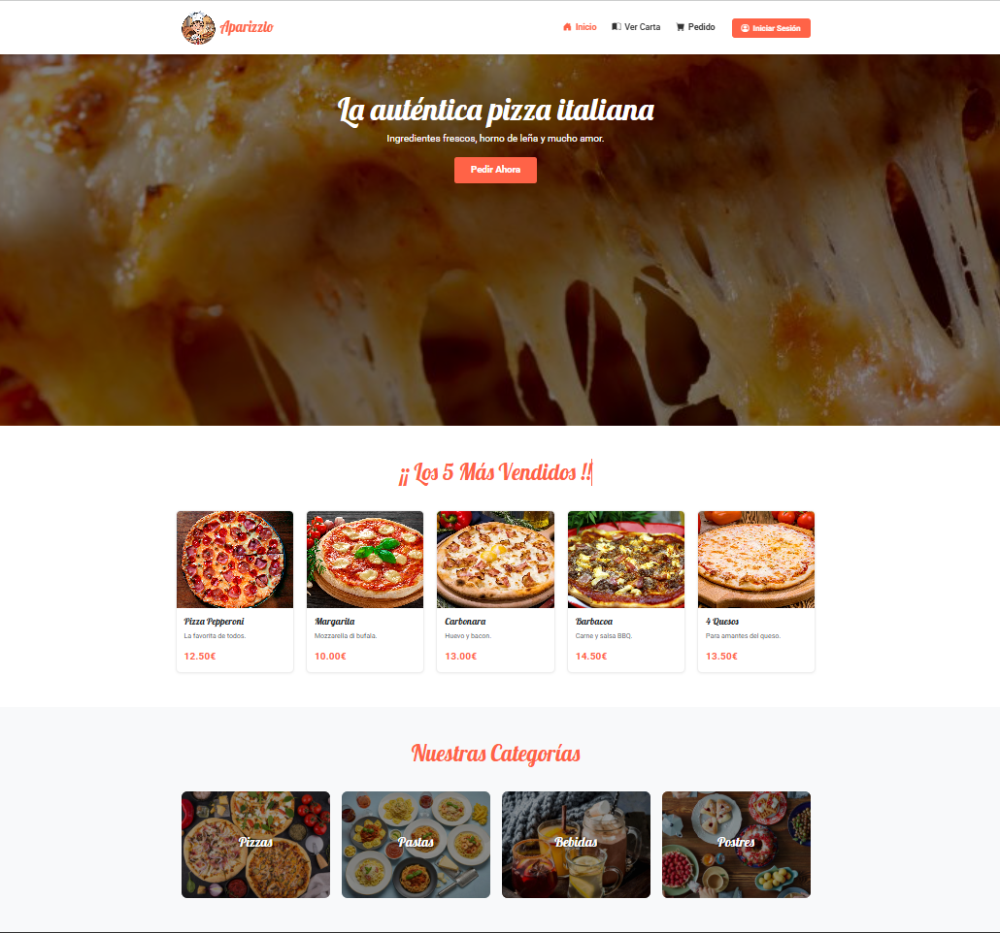

> [Descripción breve: "Página de inicio que muestra los productos destacados, categorías principales y un banner promocional. Incluye barra de navegación y acceso a registro/login para usuarios no autenticados aun."]

#### **2. Menú**
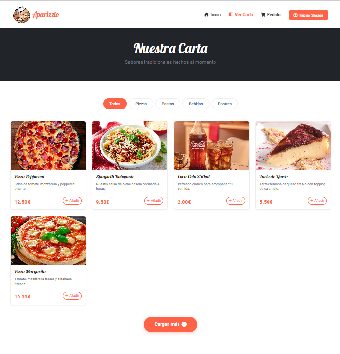

> [Descripción breve: "Listado completo del catálogo con filtros por categoría, precios visibles y tarjetas de producto. Permite entrar al detalle de cada pizza y añadirla rápidamente al carrito."]

#### **3. Categoría**


> [Descripción breve: "Vista filtrada por una categoría concreta donde se muestran solo los productos relacionados. Incluye nombre, imagen, precio y accesos directos al detalle."]

#### **4. Producto**


> [Descripción breve: "Página de detalle con imagen ampliada, descripción completa, ingredientes destacados y precio final. Ofrece acciones para elegir cantidad y añadir al carrito."]

#### **5. Carrito**
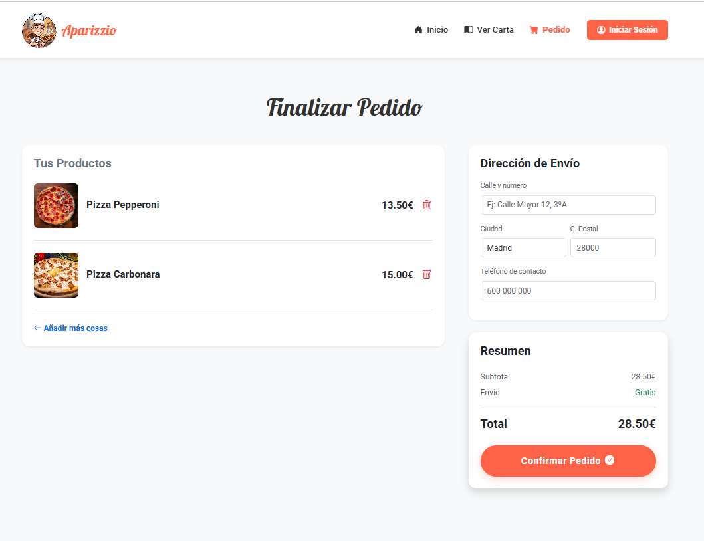

> [Descripción breve: "Resumen del pedido con productos añadidos, cantidades editables y subtotal por línea. Muestra el total final y la acción para continuar con el pago o finalizar la compra."]

#### **6. Admin - Usuarios**
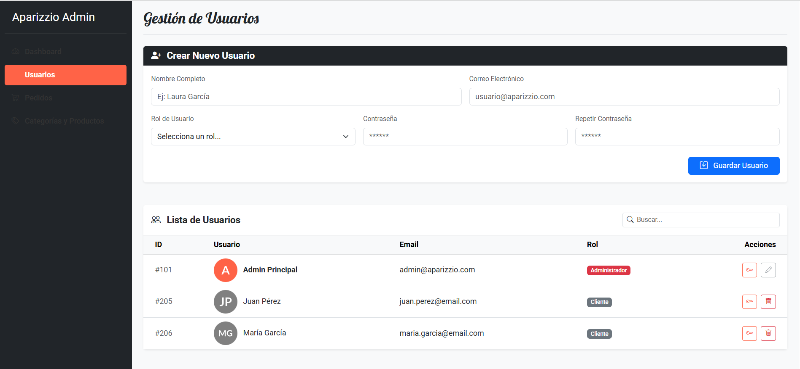

> [Descripción breve: "Panel de administración para visualizar el listado de usuarios con su rol y estado. Permite gestionar altas, bajas o cambios de permisos desde una tabla central."]

#### **7. Admin - Pedidos**
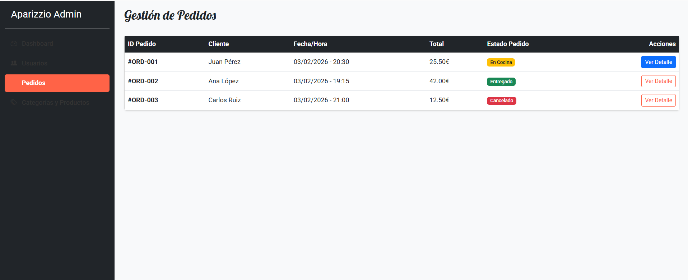

> [Descripción breve: "Gestión de pedidos mostrando estado, fecha e importe. Ofrece acceso al detalle de cada compra y opciones para actualizar el estado del pedido."]

#### **8. Admin - Categorías**
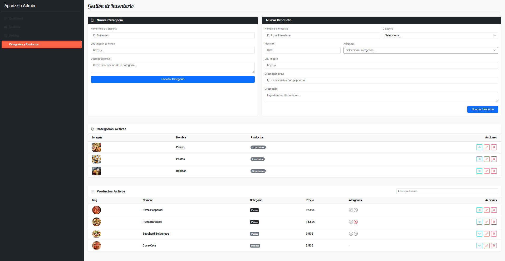

> [Descripción breve: "Administración de categorías con listado actual y acciones de crear, editar o eliminar. Facilita organizar el catálogo por tipos de producto."]

#### **9. Admin - Métricas**


> [Descripción breve: "Panel de métricas con gráficos de ventas, productos más solicitados y comparativas básicas. Ayuda a detectar tendencias y rendimiento del catálogo."]

---

## 🛠 **Práctica 1: Web con HTML generado en servidor y AJAX**

### **Vídeo de Demostración**
📹 **[Enlace al vídeo en YouTube](https://www.youtube.com/watch?v=i4-q2zWpxLo)**
> Vídeo mostrando las principales funcionalidades de la aplicación web.

### **Navegación y Capturas de Pantalla**

### **Diagrama de Navegación**
Diagrama que muestra cómo se navega entre las diferentes páginas de la aplicación:

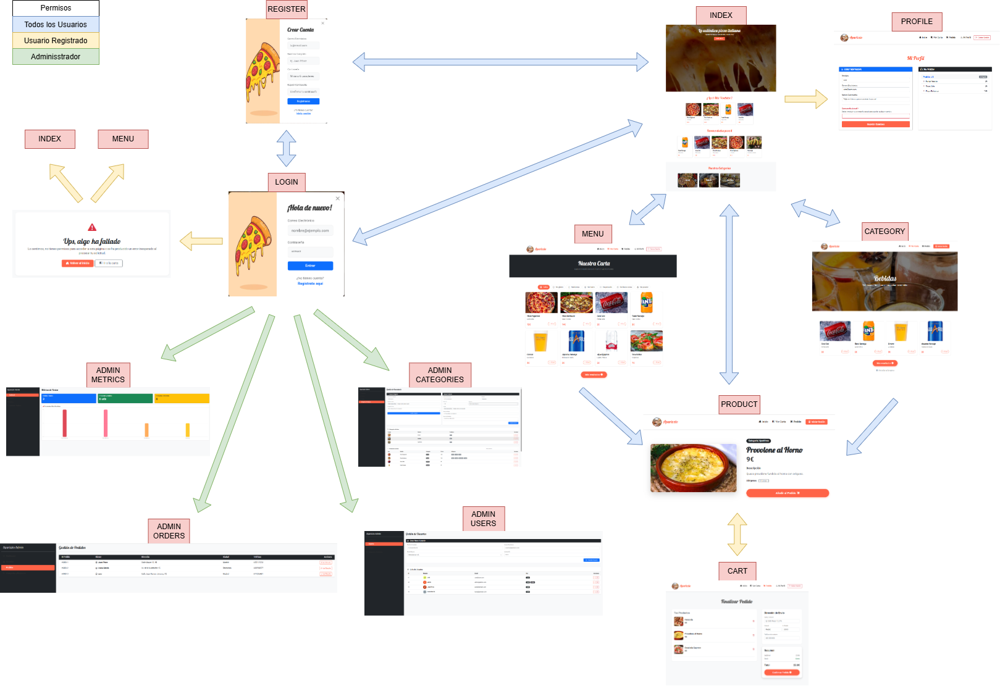

> [Descripción breve: El diagrama es similar al de la preparación, tiene como cambios el añadido de la pagina de error al intentar entrar en la zona de administradores y una pagina con el perfil para usuarios registrados.]

#### **Capturas de Pantalla Actualizadas**

#### **1. Página Principal / Home**
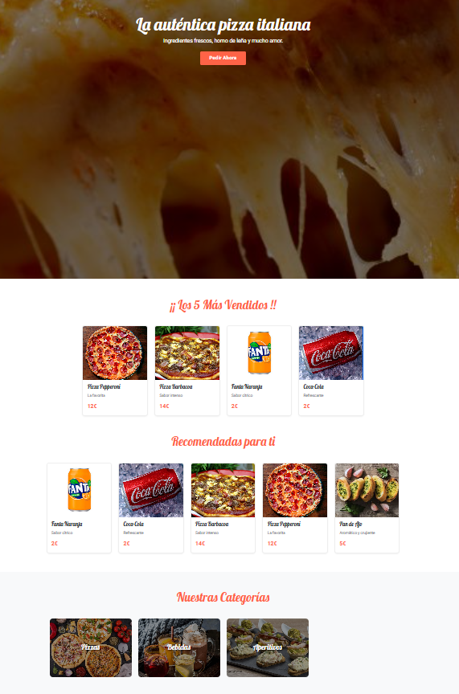

> [Descripción breve: "Respecto a la preparación, la home se adapta al usuario con historial y muestra recomendaciones personalizadas según sus pedidos anteriores, manteniendo la misma estructura visual general. También
se muestra el algoritmo de recomendación para usuarios registrados con pedidos"]

#### **2. Menú **
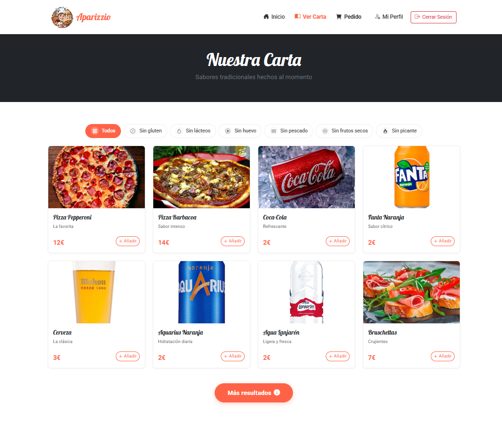

> [Descripción breve: "En esta práctica cambia el comportamiento del menú: el filtrado se hace en servidor, hay paginación con carga incremental y se mejora la interacción de filtros de alérgenos."]

#### **3. Categoría **
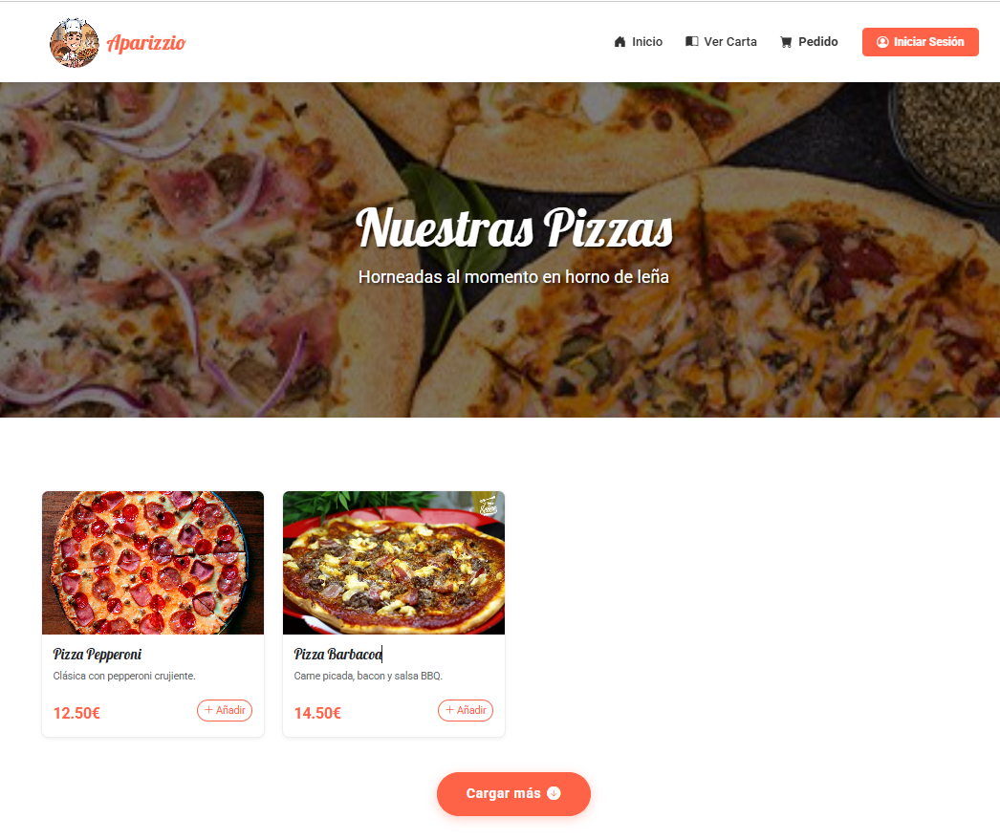

> [Descripción breve: "No hemos añadido cambios funcionales relevantes respecto a la preparación; mantiene la vista filtrada por categoría con el mismo flujo de navegación."]

#### **4. Producto **
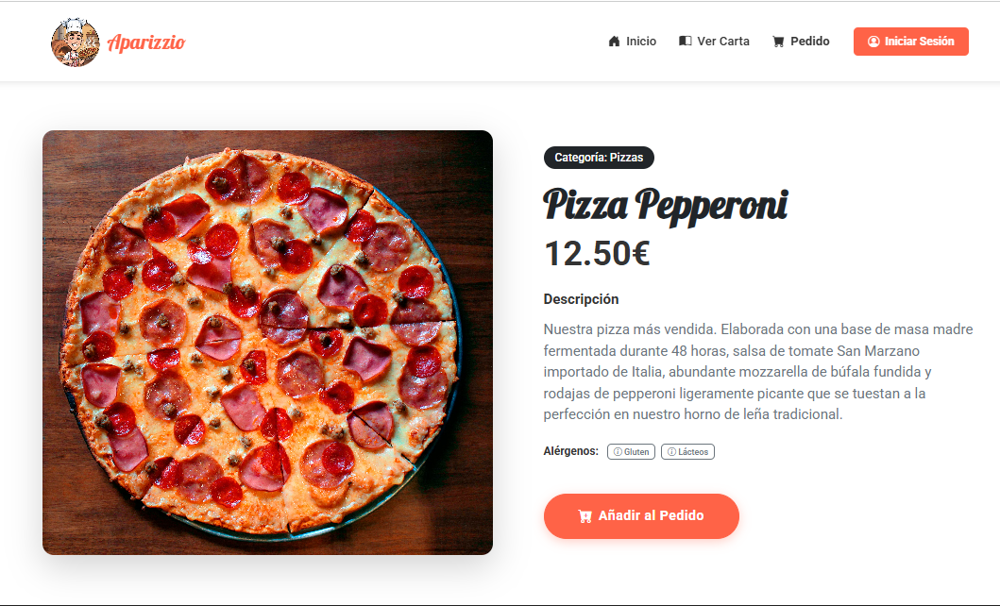

> [Descripción breve: "Se mantiene prácticamente igual que en la preparación: detalle completo del producto con opción de añadir al carrito."]

#### **5. Carrito **
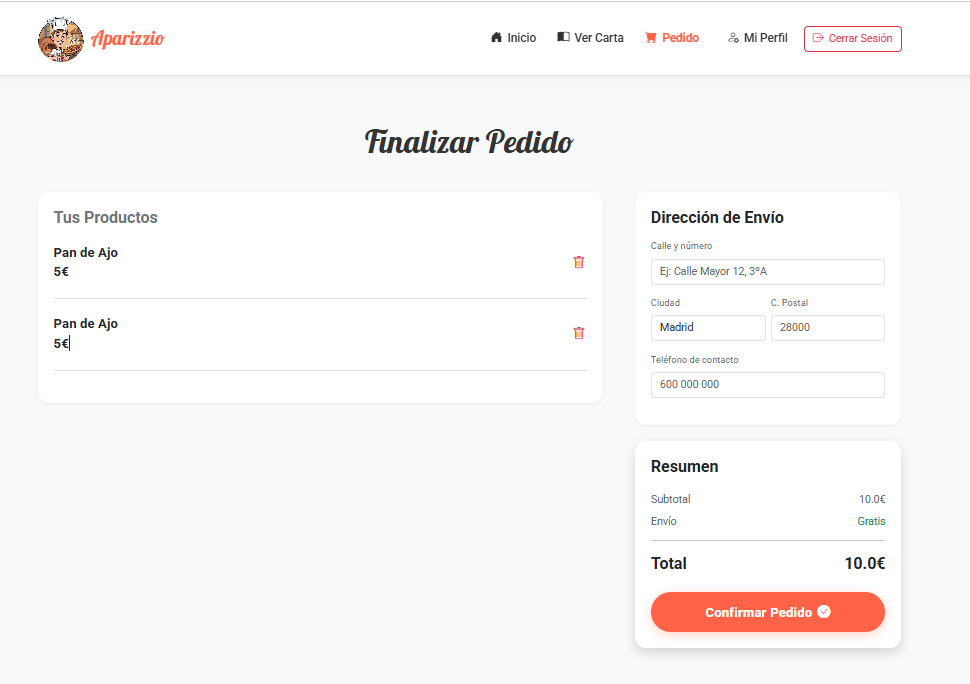

> [Descripción breve: "Conserva el flujo de preparación, mostrando resumen de líneas, cantidades y total antes de confirmar el pedido."]

#### **6. Admin **
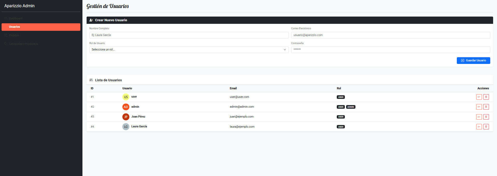

> [Descripción breve: "Respecto a la preparación, esta vista incorpora mejoras de gestión de cuentas en la administración de usuarios y ajustes relacionados con credenciales."]

#### **7. Admin - Pedidos**
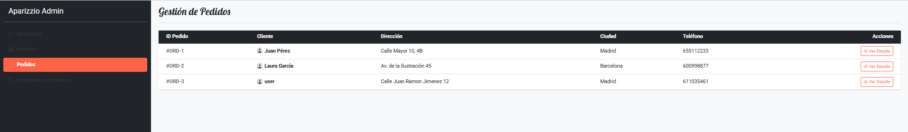

> [Descripción breve: "Mantiene la gestión de pedidos y su actualización de estado, consolidando el flujo administrativo en la parte dinámica de la práctica."]

#### **8. Admin - Categorías**
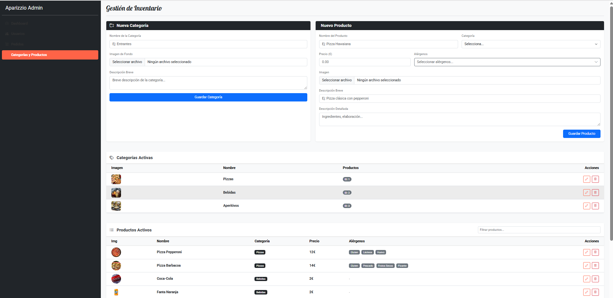

> [Descripción breve: "Continúa con el mismo objetivo que en preparación (alta, edición y borrado de categorías), integrada ya en el flujo completo de la práctica."]

#### **9. Admin - Métricas **
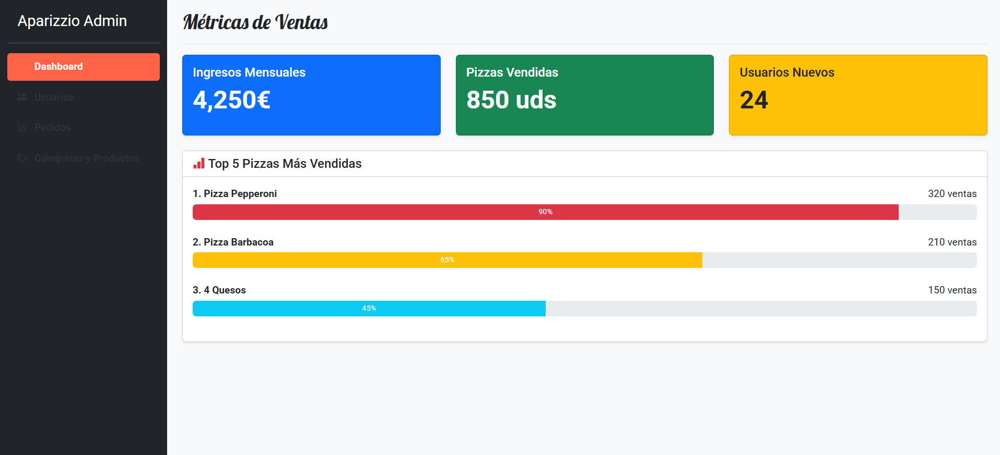

> [Descripción breve: "No cambia de forma destacable respecto a preparación; mantiene el panel de métricas con visualización de ventas y productos más relevantes."]

#### **10. Profile NUEVO**
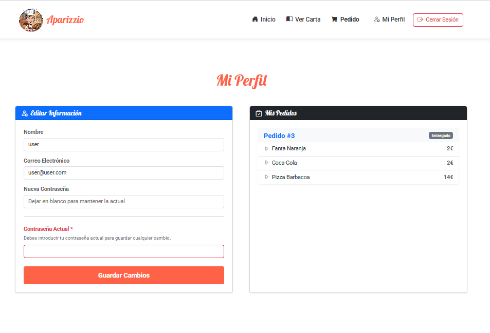

> [Descripción breve: "Nueva pantalla añadida para usuarios registrados, con consulta y edición de datos de perfil."]

#### **11. Error NUEVO**
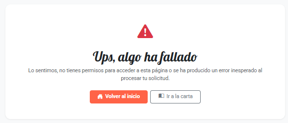

> [Descripción breve: "Nueva pantalla de error (por ejemplo, accesos sin permisos a zona admin), con diseño consistente y enlaces de retorno."]

### **Instrucciones de Ejecución**

#### **Requisitos Previos**
- **Java**: versión 21 o superior
- **Maven**: versión 3.8 o superior
- **MySQL**: versión 8.0 o superior
- **Git**: para clonar el repositorio

#### **Pasos para ejecutar la aplicación**

1. **Clonar el repositorio**
   ```bash
   git clone https://github.com/[usuario]/[nombre-repositorio].git
   cd [nombre-repositorio]
   ```

2. **Entrar en el backend**
   ```bash
   cd backend
   ```

3. **Levantar la base de datos MySQL con Docker**
   - Linux/macOS/Git Bash:
     ```bash
     sh start_db.sh
     ```
   - PowerShell:
     ```powershell
     docker run --rm -e MYSQL_ROOT_PASSWORD=password -e MYSQL_DATABASE=pizzeria -p 3306:3306 -d mysql:9.2
     ```

4. **Arrancar la aplicación Spring Boot**
   - Linux/macOS/Git Bash:
     ```bash
     ./mvnw spring-boot:run
     ```
   - PowerShell:
     ```powershell
     .\mvnw.cmd spring-boot:run
     ```

5. **Abrir la aplicación en el navegador**
   - URL: `https://localhost:8443`

#### **Credenciales de prueba**
- **Usuario Admin**: usuario: `admin@admin.com`, contraseña: `admin`
- **Usuario Registrado**: usuario: `user@user.com`, contraseña: `user`

### **Diagrama de Entidades de Base de Datos**

Diagrama mostrando las entidades, sus campos y relaciones:

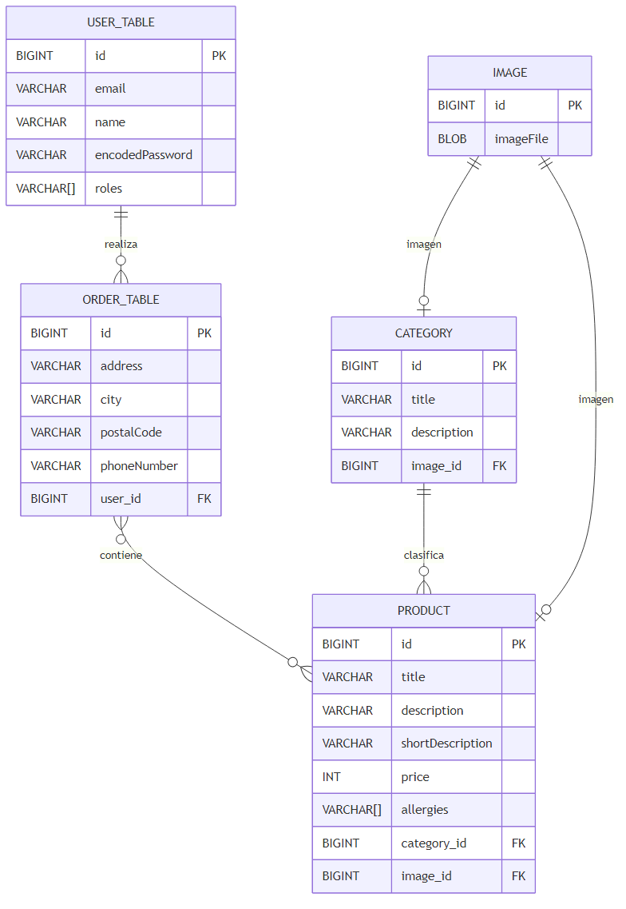

> [Descripción breve: Diagrama general de la base de datos con las entidades principales y sus relaciones.]

### **Diagrama de Clases y Templates**

Diagrama de clases de la aplicación con diferenciación por colores o secciones:

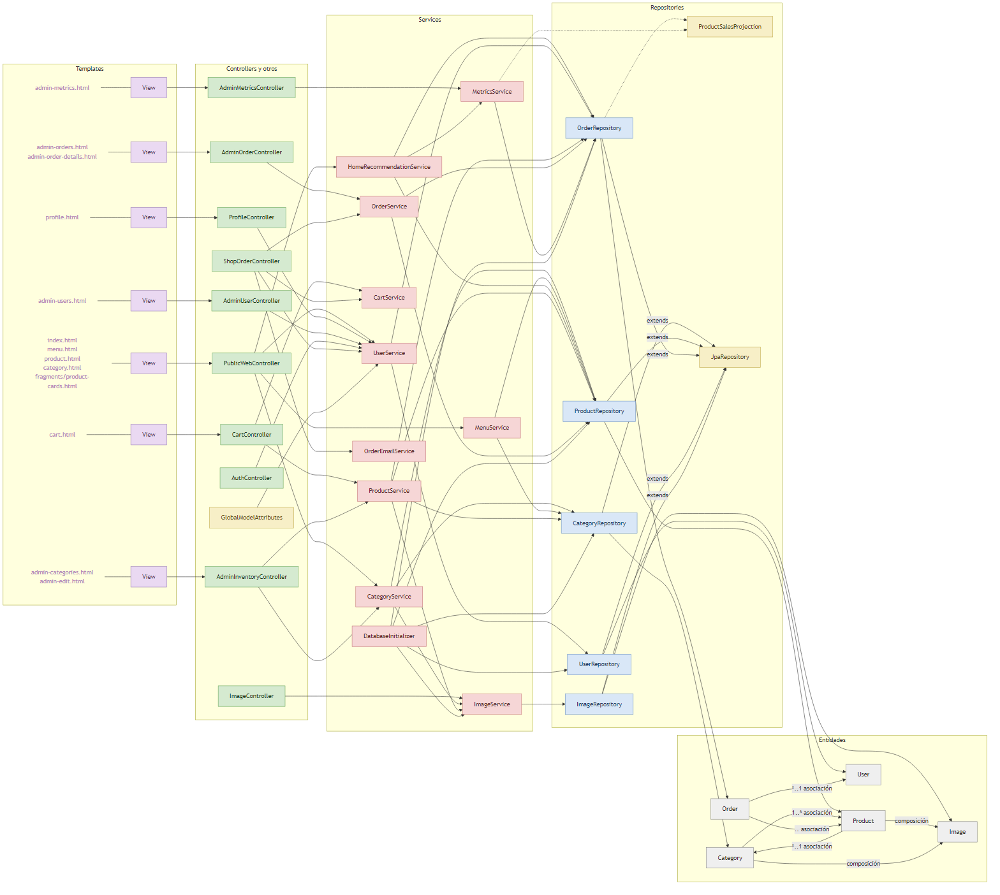

> [Descripción breve: Vista general de la estructura de clases y su organización en la aplicación.]

### **Participación de Miembros en la Práctica 1**

#### **Alumno 1 - [Mario Aparisi Castro]**

[Encargado de hacer tareas como la gráfica en el dashboard de la aplicacion web, imlementar la funcionalidad de realizar un pedido donde se guarden en base de datos los productos pedidos por el usuario y se actualice la gráfica del dashboard con los pedidos y la parte de pedidos realizados con los datos del usuario, incluyendo nombre, número de productos y datos personales.la gráfica se arregló para que en vez de recoger todos los productos y filtrar de la base de datos solo seleccionase los que queremos directamente. Añadido de la funcionalidad de correo donde al realizar un pedido se enviará un correo al correo introducido por el usuario al registarse en la pagina web, y decorado con html y css acorde al diseño de nuestra página web.Funcionalidad de top 5 vendidos donde a través de la funcionalidad anterior de la gráfica que recogía el número de productos comprados pues se hace un top 5 productos más vendidos donde se muestran y se van actuaizando a medida que se hacen los productos los mas comprados. Añadida las páginas de error a la página web con mismo formato y diseño que la página web y con redirección a esta.]

| Nº    | Commits      | Files      |
|:------------: |:------------:| :------------:|
|1| [grafica en el dashboard de los pedidos](https://github.com/CodeURJC-DAW-2025-26/practica-daw-2025-26-grupo-8/commit/bb877ce144fd2bbf8b9ee1d150774f6b11504acc)  | [WebController.java](backend/src/main/java/com/aparizzio/pizzeria/controller/WebController.java)   |
|2| [el confirmar pedido funciona y se actualiza la lista de pedidos y se actualiza la grafica de la dashboard](https://github.com/CodeURJC-DAW-2025-26/practica-daw-2025-26-grupo-8/commit/32e16720cee94c8cfe4665b2e1e6db10293750b0)  | [cart.html](backend/src/main/resources/templates/cart.html)   |
|3| [FUNCIONALIDAD CORREO ENVIADO AL HACER UN PEDIDO](https://github.com/CodeURJC-DAW-2025-26/practica-daw-2025-26-grupo-8/commit/8776d9ede6e5ad712fe305c6973924b1a8235654)  | [OrderEmailService.java](backend/src/main/java/com/aparizzio/pizzeria/service/OrderEmailService.java)   |
|4| [funcionalidad top 5 vendidos enlazados con la grafica de productos vendidos](https://github.com/CodeURJC-DAW-2025-26/practica-daw-2025-26-grupo-8/commit/0d666ff79e5ddd822d96a817ba8c2254e1886032)  | [MetricsService.java](backend/src/main/java/com/aparizzio/pizzeria/service/MetricsService.java)   |
|5| [paginas de error](https://github.com/CodeURJC-DAW-2025-26/practica-daw-2025-26-grupo-8/commit/a7d2b2b14dc18758fec969775d500b1bcc9bd480)  | [error.html](backend/src/main/resources/templates/error.html)   |

---

#### **Alumno 2 - [David Esteban Bernardo]**

[Encargado de la mejora del catálogo en la parte de usuario, implementando paginación en el menú y las categorías con AJAX y el botón de añadir mas elementos (“Load more”), pasando el filtrado de productos al servidor para evitar cargas completas en memoria. También he sido el encargado de el filtro de alérgenos (selección múltiple y botón “All”), además de añadir feedback visual con spinner de carga. En la parte de presentación y documentación, me he encargado de rutas y capturas del README para reflejar correctamente los cambios de la práctica asi como diagrama de navegación  entre otras cosas.] 

| Nº    | Commits      | Files      |
|:------------: |:------------:| :------------:|
|1| [Paginación y filtrado del menú/categoría completamente en servidor](https://github.com/CodeURJC-DAW-2025-26/practica-daw-2025-26-grupo-8/commit/9c7bfbc)  | [MenuService.java](backend/src/main/java/com/aparizzio/pizzeria/service/MenuService.java)<br>[ProductRepository.java](backend/src/main/java/com/aparizzio/pizzeria/repository/ProductRepository.java)<br>[alergensfilter.js](backend/src/main/resources/static/js/alergensfilter.js)<br>[category-menu-load-more.js](backend/src/main/resources/static/js/category-menu-load-more.js)   |
|2| [Implementación inicial de paginación con AJAX en menú y categoría](https://github.com/CodeURJC-DAW-2025-26/practica-daw-2025-26-grupo-8/commit/23205b4)  | [WebController.java](backend/src/main/java/com/aparizzio/pizzeria/controller/WebController.java)<br>[MenuService.java](backend/src/main/java/com/aparizzio/pizzeria/service/MenuService.java)<br>[ProductRepository.java](backend/src/main/java/com/aparizzio/pizzeria/repository/ProductRepository.java)<br>[category-menu-load-more.js](backend/src/main/resources/static/js/category-menu-load-more.js)<br>[menu.html](backend/src/main/resources/templates/menu.html)<br>[category.html](backend/src/main/resources/templates/category.html)<br>[product-cards.html](backend/src/main/resources/templates/fragments/product-cards.html)   |
|3| [Añadido spinner de carga y animación para mejorar la UX](https://github.com/CodeURJC-DAW-2025-26/practica-daw-2025-26-grupo-8/commit/4a64189)  | [spinner.js](backend/src/main/resources/static/js/spinner.js)<br>[styles.css](backend/src/main/resources/static/css/styles.css)   |
|4| [Soporte para selección múltiple de alérgenos](https://github.com/CodeURJC-DAW-2025-26/practica-daw-2025-26-grupo-8/commit/d50d0fa)  | [alergensfilter.js](backend/src/main/resources/static/js/alergensfilter.js)<br>[menu.html](backend/src/main/resources/templates/menu.html)   |
|5| [Botón “All” y mejoras en la lógica de activación de filtros](https://github.com/CodeURJC-DAW-2025-26/practica-daw-2025-26-grupo-8/commit/fbb9ade)  | [alergensfilter.js](backend/src/main/resources/static/js/alergensfilter.js)<br>[menu.html](backend/src/main/resources/templates/menu.html)   |

---

#### **Alumno 3 - [Alejandro Rico González]**

[Mi rol principal se ha centrado en el desarrollo Front-end dinámico, la gestión del panel de administración y la implementación robusta de la seguridad y arquitectura del Back-end:
Vistas Dinámicas (Mustache): Integración del motor de plantillas para el renderizado del catálogo, gestionando lógicas condicionales (como el fallback de imágenes) y fragmentos AJAX para la paginación fluida.
Panel de Administración: Desarrollo completo de la zona privada (/admin/**) para gestionar Usuarios, Pedidos, Categorías y Productos, incluyendo modales dinámicos de Bootstrap para operaciones críticas de borrado.
Autenticación Integrada: Diseño de un flujo propio de Login/Registro sin salir del contexto visual (mediante modales). Implementación de cifrado con BCrypt y asignación automática de roles.
Seguridad Avanzada (Spring Security): Protección activa contra CSRF en todos los formularios y control estricto de acceso basado en roles. Además, ayudé a gestionar de forma segura las excepciones redirigiendo a vistas personalizadas sin filtrar datos técnicos sensibles.
Arquitectura Limpia: Refactorización del código para garantizar la correcta separación de responsabilidades, asegurando que los Controladores (ej. PublicWebController) interactúen exclusivamente con la capa de Servicios y nunca expongan los Repositorios directamente.]

| Nº    | Commits      | Files      |
|:------------: |:------------:| :------------:|
|1| [Gestión de los permisos de usuario y admin y la redirección a sus páginas](https://github.com/CodeURJC-DAW-2025-26/practica-daw-2025-26-grupo-8/commit/1b45b4c6957b61594b60aa118fad76dd9869b7fa)  | [WebController.java](backend/src/main/java/com/aparizzio/pizzeria/controller/WebController.java)  [SecurityConfig.java](backend/src/main/java/com/aparizzio/pizzeria/security/SecurityConfig.java)  |
|2| [Gestión de productos y categorías desde la página de administración](https://github.com/CodeURJC-DAW-2025-26/practica-daw-2025-26-grupo-8/commit/3d7301916e51cc1bc7c58364d552bb0f6fee4d45)  | [Admin-categories.html](backend/src/main/resources/templates/admin-categories.html) [WebController.java](backend/src/main/java/com/aparizzio/pizzeria/controller/WebController.java)  |
|3| [Gestión de usuarios desde la pagina de administración](URL_commit_3)  | [WebController.java](backend/src/main/java/com/aparizzio/pizzeria/controller/WebController.java) [auth-modal.html](backend/src/main/resources/templates/auth-modal.html)   |
|4| [Arreglada la arquitectura y en vez de tener un solo controlador (fat controller) que manejase todo y accediese a los repository dividir todo en varios controllers y services para tener una arquitectura adecuada](https://github.com/CodeURJC-DAW-2025-26/practica-daw-2025-26-grupo-8/commit/743bf936a80325ac651a2999ef2cc5240816995c#diff-45728e80f4ce691304cf8304aff61df22c5fc415889441f7f1ca6811ae4f0b85)  | [AdminInventoryController.java](backend/src/main/java/com/aparizzio/pizzeria/controller/AdminInventoryController.java) [CategoryService.java](backend/src/main/java/com/aparizzio/pizzeria/service/CategoryService.java)  |
|5| [Refinamiento de la seguridad](https://github.com/CodeURJC-DAW-2025-26/practica-daw-2025-26-grupo-8/commit/4dd0a0c88a8652c1c8c45d80989d2e3421b64079)  | [SecurityConfig.java](backend/src/main/java/com/aparizzio/pizzeria/security/SecurityConfig.java)   |


---

#### **Alumno 4 - [Gaizka Aranbarri Berasaluze]**

[Encargado de la configuración inicial, arquitectura base y modelado de datos del proyecto. Mi labor comenzó estructurando el esqueleto de la aplicación web en Spring Boot y definiendo las entidades de dominio para su correcto mapeado en base de datos. A nivel funcional, implementé el sistema del Carrito de la compra, permitiendo a los usuarios gestionar su pre-pedido, así como la vista del Perfil de usuario para la visualización de la cuenta. Finalmente, me encargué de refactorizar la inyección de atributos globales (token CSRF y el estado booleano de inicio de sesión) para que todos los controladores dispusieran de esta información y las plantillas pudieran renderizar correctamente la barra de navegación y los modales de forma segura en cualquier ruta.]

| Nº    | Commits      | Files      |
|:------------: |:------------| :------------|
|1| [Creación de la base estructural del proyecto Spring Boot](https://github.com/CodeURJC-DAW-2025-26/practica-daw-2025-26-grupo-8/commit/06a8d5deb62216c862c676ad7dfbadcc94c69b8a)  | [pom.xml](backend/pom.xml)<br>[PizzeriaApplication.java](backend/src/main/java/com/aparizzio/pizzeria/PizzeriaApplication.java)   |
|2| [Generación del modelo de datos y entidades JPA principales](https://github.com/CodeURJC-DAW-2025-26/practica-daw-2025-26-grupo-8/commit/5fea868102266cfe36d37f4993a38ada613dee59)  | [User.java](backend/src/main/java/com/aparizzio/pizzeria/model/User.java)<br>[Product.java](backend/src/main/java/com/aparizzio/pizzeria/model/Product.java)<br>[Order.java](backend/src/main/java/com/aparizzio/pizzeria/model/Order.java)   |
|3| [Implementación de la funcionalidad y controladores del Carrito de la compra](https://github.com/CodeURJC-DAW-2025-26/practica-daw-2025-26-grupo-8/commit/c9888132deca2a03733f77c850f17fa7c6732490)  | [CartController.java](backend/src/main/java/com/aparizzio/pizzeria/controller/CartController.java)<br>[CartService.java](backend/src/main/java/com/aparizzio/pizzeria/service/CartService.java)<br>[cart.html](backend/src/main/resources/templates/cart.html)   |
|4| [Creación de la página de Perfil para usuarios registrados](https://github.com/CodeURJC-DAW-2025-26/practica-daw-2025-26-grupo-8/commit/17f9f0175215e90fcd445205d11c823e34446841)  | [ProfileController.java](backend/src/main/java/com/aparizzio/pizzeria/controller/ProfileController.java)<br>[profile.html](backend/src/main/resources/templates/profile.html)   |
|5| [Añadido de inyección global de token CSRF y estado 'logged' para todos los controladores](https://github.com/CodeURJC-DAW-2025-26/practica-daw-2025-26-grupo-8/commit/5868d82f460669ce4b41f416e5904f69b02c7b6e)  | [GlobalModelAttributes.java](backend/src/main/java/com/aparizzio/pizzeria/controller/GlobalModelAttributes.java)   |

---

## 🛠 **Práctica 2: Incorporación de una API REST a la aplicación web, despliegue con Docker y despliegue remoto**

### **Vídeo de Demostración**
📹 **[Enlace al vídeo en YouTube](https://www.youtube.com/watch?v=x91MPoITQ3I)**
> Vídeo mostrando las principales funcionalidades de la aplicación web.

### **Documentación de la API REST**

La API REST de PizzaFast está completamente documentada siguiendo la especificación **OpenAPI 3.0.3** con soporte para autenticación mediante cookies HTTP-only. La documentación incluye todos los endpoints de:
- 🔐 **Autenticación** (login, logout, refresh token)
- 👥 **Usuarios** (registro, perfil, gestión de cuentas)
- 🍕 **Productos** (catálogo, filtrado, búsqueda)
- 📂 **Categorías** (listado, gestión)
- 📦 **Pedidos** (crear, obtener, actualizar estado)
- 🖼️ **Imágenes** (subida y consulta de recursos binarios)

#### **Enlaces a la Documentación:**

- **📄 Especificación OpenAPI (YAML):** [api-docs.yaml](/api-docs/api-docs.yaml)
  
- **📖 Documentación HTML:** [apidocs.html](https://raw.githack.com/CodeURJC-DAW-2025-26/practica-daw-2025-26-grupo-8/main/api-docs/apidocs.html)
  > Visualización completa de la documentación con estilos en el navegador

#### **Características de la API:**
- ✅ Autenticación segura con JWT en cookies HTTP-only
- ✅ CORS configurado para integración frontend
- ✅ Validación de permisos basada en roles (ADMIN, USER)
- ✅ Manejo centralizado de errores con mensajes descriptivos
- ✅ Paginación en endpoints de listado
- ✅ Filtrado y búsqueda avanzada de productos

### **Diagrama de Clases y Templates Actualizado**

Diagrama actualizado incluyendo los @RestController y su relación con los @Service compartidos:


### **Instrucciones de Ejecución con Docker**

#### **Requisitos previos:**
- Docker instalado (versión 20.10 o superior)
- Docker Compose instalado (versión 2.0 o superior)

#### **Pasos para ejecutar con docker-compose:**

1. **Clonar el repositorio** (si no lo has hecho ya):
   ```bash
   git clone https://github.com/[usuario]/[repositorio].git
   cd [repositorio]
   ```

2. **(Opcional) Configurar variables de entorno**:
   - Si no defines nada, se usan estos valores por defecto:
     - `DB_NAME=pizzeria`
     - `DB_PASSWORD=password`
   - Ejemplo rápido (Linux/macOS):
     ```bash
     export DB_NAME=pizzeria
     export DB_PASSWORD=password
     ```
   - Ejemplo rápido (PowerShell):
     ```powershell
     $env:DB_NAME="pizzeria"
     $env:DB_PASSWORD="password"
     ```

3. **Levantar los servicios (MySQL + app)**:
   ```bash
   docker compose up -d
   ```

4. **Comprobar estado y logs**:
   ```bash
   docker compose ps
   docker compose logs -f app
   ```

5. **Abrir la aplicación en el navegador**:
   - URL: `https://localhost:8443`

6. **Parar y eliminar contenedores cuando termines**:
   ```bash
   docker compose down
   ```

### **Construcción de la Imagen Docker**

#### **Requisitos:**
- Docker instalado en el sistema

#### **Pasos para construir y publicar la imagen:**

1. **Navegar a la raíz del proyecto** (donde están `Dockerfile` y scripts):
   ```bash
   cd [repositorio]
   ```

2. **Construir la imagen Docker**:
   - Linux/macOS:
     ```bash
     chmod +x create_image.sh
     ./create_image.sh pizzeria
     ```
   - PowerShell:
     ```powershell
     .\create_image.bat pizzeria
     ```
   - Alternativa manual:
     ```bash
     docker build -t pizzeria .
     ```

3. **Verificar que la imagen existe**:
   - Linux/macOS:
     ```bash
     docker images | grep pizzeria
     ```
   - PowerShell:
     ```powershell
     docker images | findstr pizzeria
     ```

4. **Publicar en Docker Hub**:
   - Iniciar sesión:
     ```bash
     docker login
     ```
   - Publicar con scripts:
     - Linux/macOS:
       ```bash
       chmod +x publish_image.sh
       ./publish_image.sh pizzeria <tu_usuario_dockerhub>
       ```
     - PowerShell:
       ```powershell
       .\publish_image.bat pizzeria <tu_usuario_dockerhub>
       ```
   - Equivalente manual:
     ```bash
     docker tag pizzeria <tu_usuario_dockerhub>/pizzeria
     docker push <tu_usuario_dockerhub>/pizzeria
     ```

### **Despliegue en Máquina Virtual**

#### **Requisitos:**
- Acceso a la máquina virtual (SSH)
- Clave privada para autenticación
- Conexión a la red correspondiente o VPN configurada

#### **Pasos para desplegar:**

1. **Conectar a la máquina virtual**:
   ```bash
   ssh -i [ruta/a/clave.key] [usuario]@[IP-o-dominio-VM]
   ```
   
   Ejemplo:
   ```bash
   ssh -i ssh-keys/app.key vmuser@10.100.139.XXX
   ```

2. **AQUÍ LOS SIGUIENTES PASOS**:

### **URL de la Aplicación Desplegada**

🌐 **URL de acceso**: `https://[nombre-app].etsii.urjc.es:8443`

#### **Credenciales de Usuarios de Ejemplo**

| Rol | Usuario | Contraseña |
|:---|:---|:---|
| Administrador | admin | admin123 |
| Usuario Registrado | user1 | user123 |
| Usuario Registrado | user2 | user123 |

### **Participación de Miembros en la Práctica 2**


---

#### **Alumno 2 - Alejandro Rico González**

Encargado de la mayor parte de la migración a API REST de la página, apoyo en la creación y validación de la colección de Postman, y control/corrección de errores de arquitectura en controladores, servicios y configuración de seguridad.

| Nº    | Commits      | Files      |
|:------------: |:------------:| :------------:|
|1| [Refactor controllers and services to improve structure and add new user registration and order retrieval features](https://github.com/CodeURJC-DAW-2025-26/practica-daw-2025-26-grupo-8/commit/8828219e625d6dc2d9738a52ecc43ea0ef78309a) | [CategoryRestController.java](https://github.com/CodeURJC-DAW-2025-26/practica-daw-2025-26-grupo-8/blob/8828219e625d6dc2d9738a52ecc43ea0ef78309a/backend/src/main/java/com/aparizzio/pizzeria/controller/CategoryRestController.java), [OrderRestController.java](https://github.com/CodeURJC-DAW-2025-26/practica-daw-2025-26-grupo-8/blob/8828219e625d6dc2d9738a52ecc43ea0ef78309a/backend/src/main/java/com/aparizzio/pizzeria/controller/OrderRestController.java), [ProductRestController.java](https://github.com/CodeURJC-DAW-2025-26/practica-daw-2025-26-grupo-8/blob/8828219e625d6dc2d9738a52ecc43ea0ef78309a/backend/src/main/java/com/aparizzio/pizzeria/controller/ProductRestController.java), [UserRestController.java](https://github.com/CodeURJC-DAW-2025-26/practica-daw-2025-26-grupo-8/blob/8828219e625d6dc2d9738a52ecc43ea0ef78309a/backend/src/main/java/com/aparizzio/pizzeria/controller/UserRestController.java), [mappers/DTOs/services/security](https://github.com/CodeURJC-DAW-2025-26/practica-daw-2025-26-grupo-8/commit/8828219e625d6dc2d9738a52ecc43ea0ef78309a) |
|2| [logica api rest para editar perfil y hacer pedidos](https://github.com/CodeURJC-DAW-2025-26/practica-daw-2025-26-grupo-8/commit/604fb6b8593c034c29dcbe98933c158e40482fa9) | [CategoryRestController.java](https://github.com/CodeURJC-DAW-2025-26/practica-daw-2025-26-grupo-8/blob/604fb6b8593c034c29dcbe98933c158e40482fa9/backend/src/main/java/com/aparizzio/pizzeria/controller/CategoryRestController.java), [OrderRestController.java](https://github.com/CodeURJC-DAW-2025-26/practica-daw-2025-26-grupo-8/blob/604fb6b8593c034c29dcbe98933c158e40482fa9/backend/src/main/java/com/aparizzio/pizzeria/controller/OrderRestController.java), [UserRestController.java](https://github.com/CodeURJC-DAW-2025-26/practica-daw-2025-26-grupo-8/blob/604fb6b8593c034c29dcbe98933c158e40482fa9/backend/src/main/java/com/aparizzio/pizzeria/controller/UserRestController.java), [OrderRequestDTO.java](https://github.com/CodeURJC-DAW-2025-26/practica-daw-2025-26-grupo-8/blob/604fb6b8593c034c29dcbe98933c158e40482fa9/backend/src/main/java/com/aparizzio/pizzeria/dto/OrderRequestDTO.java), [UserUpdateDTO.java](https://github.com/CodeURJC-DAW-2025-26/practica-daw-2025-26-grupo-8/blob/604fb6b8593c034c29dcbe98933c158e40482fa9/backend/src/main/java/com/aparizzio/pizzeria/dto/UserUpdateDTO.java) |
|3| [Implement image handling in Product and Image REST controllers with DTOs and mappers](https://github.com/CodeURJC-DAW-2025-26/practica-daw-2025-26-grupo-8/commit/048a1b4cd0a7e501bed235e1c2d398825ebf9e12) | [PizzeriaApplication.java](https://github.com/CodeURJC-DAW-2025-26/practica-daw-2025-26-grupo-8/blob/048a1b4cd0a7e501bed235e1c2d398825ebf9e12/backend/src/main/java/com/aparizzio/pizzeria/PizzeriaApplication.java), [ImageRestController.java](https://github.com/CodeURJC-DAW-2025-26/practica-daw-2025-26-grupo-8/blob/048a1b4cd0a7e501bed235e1c2d398825ebf9e12/backend/src/main/java/com/aparizzio/pizzeria/controller/ImageRestController.java), [ProductRestController.java](https://github.com/CodeURJC-DAW-2025-26/practica-daw-2025-26-grupo-8/blob/048a1b4cd0a7e501bed235e1c2d398825ebf9e12/backend/src/main/java/com/aparizzio/pizzeria/controller/ProductRestController.java), [ImageDTO.java](https://github.com/CodeURJC-DAW-2025-26/practica-daw-2025-26-grupo-8/blob/048a1b4cd0a7e501bed235e1c2d398825ebf9e12/backend/src/main/java/com/aparizzio/pizzeria/dto/ImageDTO.java), [ImageMapper.java](https://github.com/CodeURJC-DAW-2025-26/practica-daw-2025-26-grupo-8/blob/048a1b4cd0a7e501bed235e1c2d398825ebf9e12/backend/src/main/java/com/aparizzio/pizzeria/dto/ImageMapper.java), [ProductService.java](https://github.com/CodeURJC-DAW-2025-26/practica-daw-2025-26-grupo-8/blob/048a1b4cd0a7e501bed235e1c2d398825ebf9e12/backend/src/main/java/com/aparizzio/pizzeria/service/ProductService.java) |
|4| [Add image upload and management for categories, enhance order and user management endpoints](https://github.com/CodeURJC-DAW-2025-26/practica-daw-2025-26-grupo-8/commit/8083b6a2c7ca043e331a70344df3cd17fd0d4125) | [CategoryRestController.java](https://github.com/CodeURJC-DAW-2025-26/practica-daw-2025-26-grupo-8/blob/8083b6a2c7ca043e331a70344df3cd17fd0d4125/backend/src/main/java/com/aparizzio/pizzeria/controller/CategoryRestController.java), [OrderRestController.java](https://github.com/CodeURJC-DAW-2025-26/practica-daw-2025-26-grupo-8/blob/8083b6a2c7ca043e331a70344df3cd17fd0d4125/backend/src/main/java/com/aparizzio/pizzeria/controller/OrderRestController.java), [ProductRestController.java](https://github.com/CodeURJC-DAW-2025-26/practica-daw-2025-26-grupo-8/blob/8083b6a2c7ca043e331a70344df3cd17fd0d4125/backend/src/main/java/com/aparizzio/pizzeria/controller/ProductRestController.java), [UserRestController.java](https://github.com/CodeURJC-DAW-2025-26/practica-daw-2025-26-grupo-8/blob/8083b6a2c7ca043e331a70344df3cd17fd0d4125/backend/src/main/java/com/aparizzio/pizzeria/controller/UserRestController.java), [UserRegisterDTO.java](https://github.com/CodeURJC-DAW-2025-26/practica-daw-2025-26-grupo-8/blob/8083b6a2c7ca043e331a70344df3cd17fd0d4125/backend/src/main/java/com/aparizzio/pizzeria/dto/UserRegisterDTO.java), [UserService.java](https://github.com/CodeURJC-DAW-2025-26/practica-daw-2025-26-grupo-8/blob/8083b6a2c7ca043e331a70344df3cd17fd0d4125/backend/src/main/java/com/aparizzio/pizzeria/service/UserService.java) |
|5| [Refactor SecurityConfig to improve authentication management and API security configuration](https://github.com/CodeURJC-DAW-2025-26/practica-daw-2025-26-grupo-8/commit/3732d0aa30fd8c8eaa8c7fd16045e11e14937b0e) | [SecurityConfig.java](https://github.com/CodeURJC-DAW-2025-26/practica-daw-2025-26-grupo-8/blob/3732d0aa30fd8c8eaa8c7fd16045e11e14937b0e/backend/src/main/java/com/aparizzio/pizzeria/security/SecurityConfig.java) |

---

<<<<<<< HEAD
#### **Alumno 2 - Mario Aparisi Castro**

Encargado de la implementación y ajuste de endpoints REST clave (pedidos con correo y métricas), integración de docker-compose para despliegue, automatización de scripts de publicación en entorno Windows y exportación de la colección de Postman para pruebas de la API.

| Nº    | Commits      | Files      |
|:------------: |:------------:| :------------:|
|1| [API rest correo usuario pedido](https://github.com/CodeURJC-DAW-2025-26/practica-daw-2025-26-grupo-8/commit/c3536ebaf4ba7d322f7cdd732a3b81073e692de7) | [OrderRestController.java](https://github.com/CodeURJC-DAW-2025-26/practica-daw-2025-26-grupo-8/blob/c3536ebaf4ba7d322f7cdd732a3b81073e692de7/backend/src/main/java/com/aparizzio/pizzeria/controller/OrderRestController.java), [DatabaseInitializer.java](https://github.com/CodeURJC-DAW-2025-26/practica-daw-2025-26-grupo-8/blob/c3536ebaf4ba7d322f7cdd732a3b81073e692de7/backend/src/main/java/com/aparizzio/pizzeria/service/DatabaseInitializer.java) |
|2| [API rest grafica](https://github.com/CodeURJC-DAW-2025-26/practica-daw-2025-26-grupo-8/commit/5f9e4d007e79998fd3cd3bf09c1bd14f66afd555) | [MetricsRestController.java](https://github.com/CodeURJC-DAW-2025-26/practica-daw-2025-26-grupo-8/blob/5f9e4d007e79998fd3cd3bf09c1bd14f66afd555/backend/src/main/java/com/aparizzio/pizzeria/controller/MetricsRestController.java) |
|3| [docker compose](https://github.com/CodeURJC-DAW-2025-26/practica-daw-2025-26-grupo-8/commit/a8fc062439a1a3a618d01122f289a0a3513d9df6) | [docker-compose.yml](https://github.com/CodeURJC-DAW-2025-26/practica-daw-2025-26-grupo-8/blob/a8fc062439a1a3a618d01122f289a0a3513d9df6/docker-compose.yml) |
|4| [scripts imagen windows](https://github.com/CodeURJC-DAW-2025-26/practica-daw-2025-26-grupo-8/commit/d7cde9881e8e6a215e2f88e1d47be75d4de6a15d) | [publish_docker-compose.ps1](https://github.com/CodeURJC-DAW-2025-26/practica-daw-2025-26-grupo-8/blob/d7cde9881e8e6a215e2f88e1d47be75d4de6a15d/publish_docker-compose.ps1) |
|5| [exportado postman](https://github.com/CodeURJC-DAW-2025-26/practica-daw-2025-26-grupo-8/commit/a5a20117c59794cf9f32454b3e291cc9343d9a99) | [Aparizzio API.postman_collection.json](https://github.com/CodeURJC-DAW-2025-26/practica-daw-2025-26-grupo-8/blob/a5a20117c59794cf9f32454b3e291cc9343d9a99/Aparizzio%20API.postman_collection.json) |
=======
#### **Alumno 3 - Gaizka Aranbarri Berasaluze**

Implementación de la API REST, seguridad con JWT y configuración de Docker.

| Nº    | Commits      | Files      |
|:------------: |:------------:| :------------:|
|1| [Implement JWT authentication with login, refresh, and logout endpoints](https://github.com/CodeURJC-DAW-2025-26/practica-daw-2025-26-grupo-8/commit/69107d9) | [AuthRestController.java](https://github.com/CodeURJC-DAW-2025-26/practica-daw-2025-26-grupo-8/blob/69107d9/backend/src/main/java/com/aparizzio/pizzeria/controller/AuthRestController.java) |
|2| [Update REST controller endpoints to include versioning in the URL](https://github.com/CodeURJC-DAW-2025-26/practica-daw-2025-26-grupo-8/commit/6efbb59) | [ProductRestController.java](https://github.com/CodeURJC-DAW-2025-26/practica-daw-2025-26-grupo-8/blob/6efbb59/backend/src/main/java/com/aparizzio/pizzeria/controller/ProductRestController.java) |
|3| [Add Category and Product REST controllers with CRUD operations](https://github.com/CodeURJC-DAW-2025-26/practica-daw-2025-26-grupo-8/commit/e0be3af) | [CategoryRestController.java](https://github.com/CodeURJC-DAW-2025-26/practica-daw-2025-26-grupo-8/blob/e0be3af/backend/src/main/java/com/aparizzio/pizzeria/controller/CategoryRestController.java) |
|4| [Set up docker compose to work with dockerhub image](https://github.com/CodeURJC-DAW-2025-26/practica-daw-2025-26-grupo-8/commit/3d94d5f) | [docker-compose.yml](https://github.com/CodeURJC-DAW-2025-26/practica-daw-2025-26-grupo-8/blob/3d94d5f/docker-compose.yml) |
|5| [Docker build and publish scripts and env addition to docker compose](https://github.com/CodeURJC-DAW-2025-26/practica-daw-2025-26-grupo-8/commit/d720e07) | [create_image.sh](https://github.com/CodeURJC-DAW-2025-26/practica-daw-2025-26-grupo-8/blob/d720e07/create_image.sh) |
>>>>>>> a5b63fcadf4adc42af4101ca27a7867bf39229e9

---

#### **Alumno 4 - [Nombre Completo]**

[Descripción de las tareas y responsabilidades principales del alumno en el proyecto]

| Nº    | Commits      | Files      |
|:------------: |:------------:| :------------:|
|1| [Descripción commit 1](URL_commit_1)  | [Archivo1](URL_archivo_1)   |
|2| [Descripción commit 2](URL_commit_2)  | [Archivo2](URL_archivo_2)   |
|3| [Descripción commit 3](URL_commit_3)  | [Archivo3](URL_archivo_3)   |
|4| [Descripción commit 4](URL_commit_4)  | [Archivo4](URL_archivo_4)   |
|5| [Descripción commit 5](URL_commit_5)  | [Archivo5](URL_archivo_5)   |

---

## 🛠 **Práctica 3: Implementación de la web con arquitectura SPA**

### **Vídeo de Demostración**
📹 **[Enlace al vídeo en YouTube](URL_del_video)**
> Vídeo mostrando las principales funcionalidades de la aplicación web.

### **Preparación del Entorno de Desarrollo**

#### **Requisitos Previos**
- **Node.js**: versión 18.x o superior
- **npm**: versión 9.x o superior (se instala con Node.js)
- **Git**: para clonar el repositorio

#### **Pasos para configurar el entorno de desarrollo**

1. **Instalar Node.js y npm**
   
   Descarga e instala Node.js desde [https://nodejs.org/](https://nodejs.org/)
   
   Verifica la instalación:
   ```bash
   node --version
   npm --version
   ```

2. **Clonar el repositorio** (si no lo has hecho ya)
   ```bash
   git clone https://github.com/[usuario]/[nombre-repositorio].git
   cd [nombre-repositorio]
   ```

3. **Navegar a la carpeta del proyecto React**
   ```bash
   cd frontend
   ```

4. **AQUÍ LOS SIGUIENTES PASOS**

### **Diagrama de Clases y Templates de la SPA**

Diagrama mostrando los componentes React, hooks personalizados, servicios y sus relaciones:


### **Participación de Miembros en la Práctica 3**

#### **Alumno 1 - [Nombre Completo]**

[Descripción de las tareas y responsabilidades principales del alumno en el proyecto]

| Nº    | Commits      | Files      |
|:------------: |:------------:| :------------:|
|1| [Descripción commit 1](URL_commit_1)  | [Archivo1](URL_archivo_1)   |
|2| [Descripción commit 2](URL_commit_2)  | [Archivo2](URL_archivo_2)   |
|3| [Descripción commit 3](URL_commit_3)  | [Archivo3](URL_archivo_3)   |
|4| [Descripción commit 4](URL_commit_4)  | [Archivo4](URL_archivo_4)   |
|5| [Descripción commit 5](URL_commit_5)  | [Archivo5](URL_archivo_5)   |

---

#### **Alumno 2 - [Nombre Completo]**

[Descripción de las tareas y responsabilidades principales del alumno en el proyecto]

| Nº    | Commits      | Files      |
|:------------: |:------------:| :------------:|
|1| [Descripción commit 1](URL_commit_1)  | [Archivo1](URL_archivo_1)   |
|2| [Descripción commit 2](URL_commit_2)  | [Archivo2](URL_archivo_2)   |
|3| [Descripción commit 3](URL_commit_3)  | [Archivo3](URL_archivo_3)   |
|4| [Descripción commit 4](URL_commit_4)  | [Archivo4](URL_archivo_4)   |
|5| [Descripción commit 5](URL_commit_5)  | [Archivo5](URL_archivo_5)   |

---

#### **Alumno 3 - Gaizka Aranbarri Berasaluze**

Implementación de la API REST, seguridad con JWT y configuración de Docker.

| Nº    | Commits      | Files      |
|:------------: |:------------:| :------------:|
|1| [Implement JWT authentication with login, refresh, and logout endpoints](https://github.com/CodeURJC-DAW-2025-26/practica-daw-2025-26-grupo-8/commit/69107d9) | [AuthRestController.java](https://github.com/CodeURJC-DAW-2025-26/practica-daw-2025-26-grupo-8/blob/69107d9/backend/src/main/java/com/aparizzio/pizzeria/controller/AuthRestController.java) |
|2| [Update REST controller endpoints to include versioning in the URL](https://github.com/CodeURJC-DAW-2025-26/practica-daw-2025-26-grupo-8/commit/6efbb59) | [ProductRestController.java](https://github.com/CodeURJC-DAW-2025-26/practica-daw-2025-26-grupo-8/blob/6efbb59/backend/src/main/java/com/aparizzio/pizzeria/controller/ProductRestController.java) |
|3| [Add Category and Product REST controllers with CRUD operations](https://github.com/CodeURJC-DAW-2025-26/practica-daw-2025-26-grupo-8/commit/e0be3af) | [CategoryRestController.java](https://github.com/CodeURJC-DAW-2025-26/practica-daw-2025-26-grupo-8/blob/e0be3af/backend/src/main/java/com/aparizzio/pizzeria/controller/CategoryRestController.java) |
|4| [Set up docker compose to work with dockerhub image](https://github.com/CodeURJC-DAW-2025-26/practica-daw-2025-26-grupo-8/commit/3d94d5f) | [docker-compose.yml](https://github.com/CodeURJC-DAW-2025-26/practica-daw-2025-26-grupo-8/blob/3d94d5f/docker-compose.yml) |
|5| [Docker build and publish scripts and env addition to docker compose](https://github.com/CodeURJC-DAW-2025-26/practica-daw-2025-26-grupo-8/commit/d720e07) | [create_image.sh](https://github.com/CodeURJC-DAW-2025-26/practica-daw-2025-26-grupo-8/blob/d720e07/create_image.sh) |

---

#### **Alumno 4 - [Nombre Completo]**

[Descripción de las tareas y responsabilidades principales del alumno en el proyecto]

| Nº    | Commits      | Files      |
|:------------: |:------------:| :------------:|
|1| [Descripción commit 1](URL_commit_1)  | [Archivo1](URL_archivo_1)   |
|2| [Descripción commit 2](URL_commit_2)  | [Archivo2](URL_archivo_2)   |
|3| [Descripción commit 3](URL_commit_3)  | [Archivo3](URL_archivo_3)   |
|4| [Descripción commit 4](URL_commit_4)  | [Archivo4](URL_archivo_4)   |
|5| [Descripción commit 5](URL_commit_5)  | [Archivo5](URL_archivo_5)   |

