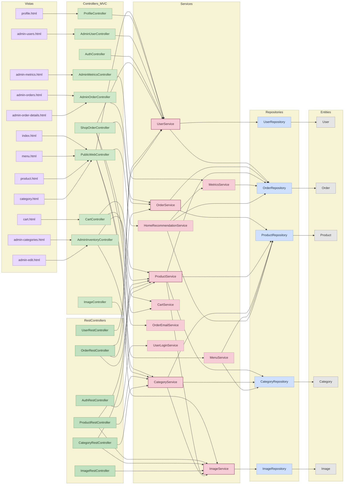

# Diagrama de clases actualizado

```mermaid
flowchart LR
  subgraph Vistas
    index[index.html]
    menu[menu.html]
    product[product.html]
    category[category.html]
    cart[cart.html]
    profile[profile.html]
    adminCat[admin-categories.html]
    adminEdit[admin-edit.html]
    adminMetrics[admin-metrics.html]
    adminOrders[admin-orders.html]
    adminOrderDetails[admin-order-details.html]
    adminUsers[admin-users.html]
  end

  subgraph Controllers_MVC
    PublicWebController
    CartController
    ProfileController
    AdminInventoryController
    AdminMetricsController
    AdminOrderController
    AdminUserController
    AuthController
    ShopOrderController
    ImageController
  end

  subgraph RestControllers
    AuthRestController
    UserRestController
    OrderRestController
    ProductRestController
    CategoryRestController
    ImageRestController
  end

  subgraph Services
    s_user[UserService]
    s_order[OrderService]
    s_product[ProductService]
    s_category[CategoryService]
    s_image[ImageService]
    s_menu[MenuService]
    s_metrics[MetricsService]
    s_home[HomeRecommendationService]
    s_cart[CartService]
    s_email[OrderEmailService]
    s_login[UserLoginService]
  end

  subgraph Repositories
    UserRepository
    OrderRepository
    ProductRepository
    CategoryRepository
    ImageRepository
  end

  subgraph Entities
    User
    Order
    Product
    Category
    Image
  end

  index --> PublicWebController
  menu --> PublicWebController
  product --> PublicWebController
  category --> PublicWebController
  cart --> CartController
  profile --> ProfileController
  adminCat --> AdminInventoryController
  adminEdit --> AdminInventoryController
  adminMetrics --> AdminMetricsController
  adminOrders --> AdminOrderController
  adminOrderDetails --> AdminOrderController
  adminUsers --> AdminUserController

  PublicWebController --> s_category
  PublicWebController --> s_menu
  PublicWebController --> s_home
  PublicWebController --> s_user
  CartController --> s_cart
  CartController --> s_product
  ProfileController --> s_user
  AdminInventoryController --> s_category
  AdminInventoryController --> s_product
  AdminMetricsController --> s_metrics
  AdminOrderController --> s_order
  AdminUserController --> s_user
  AuthController --> s_user
  ShopOrderController --> s_order
  ShopOrderController --> s_cart
  ShopOrderController --> s_user
  ShopOrderController --> s_email
  ImageController --> s_image

  AuthRestController --> s_login
  UserRestController --> s_user
  OrderRestController --> s_order
  OrderRestController --> s_product
  OrderRestController --> s_user
  ProductRestController --> s_product
  ProductRestController --> s_image
  ProductRestController --> s_category
  CategoryRestController --> s_category
  CategoryRestController --> s_product
  CategoryRestController --> s_image
  ImageRestController --> s_image

  s_home --> s_metrics
  s_product --> s_image
  s_category --> s_image

  s_user --> UserRepository
  s_user --> OrderRepository
  s_order --> OrderRepository
  s_order --> ProductRepository
  s_product --> ProductRepository
  s_product --> CategoryRepository
  s_product --> OrderRepository
  s_category --> CategoryRepository
  s_category --> ProductRepository
  s_image --> ImageRepository
  s_menu --> ProductRepository
  s_menu --> CategoryRepository
  s_metrics --> OrderRepository
  s_home --> ProductRepository
  s_home --> OrderRepository

  UserRepository --> User
  OrderRepository --> Order
  ProductRepository --> Product
  CategoryRepository --> Category
  ImageRepository --> Image

  %% Palette similar to reference image
  classDef templateNode fill:#e8d7ff,stroke:#a58bc7,color:#3f2f52,stroke-width:1px;
  classDef controllerNode fill:#cfe8c9,stroke:#7faa73,color:#264225,stroke-width:1px;
  classDef restControllerNode fill:#bfe0be,stroke:#6f9d6c,color:#233d22,stroke-width:1px;
  classDef serviceNode fill:#f6ccd6,stroke:#c9899a,color:#4b2a33,stroke-width:1px;
  classDef repositoryNode fill:#cfe0ff,stroke:#8ea7d8,color:#1f2e4d,stroke-width:1px;
  classDef entityNode fill:#e5e5e5,stroke:#9a9a9a,color:#2f2f2f,stroke-width:1px;
  classDef shared fill:#f6ccd6,stroke:#a66577,stroke-width:2px;

  class index,menu,product,category,cart,profile,adminCat,adminEdit,adminMetrics,adminOrders,adminOrderDetails,adminUsers templateNode;
  class PublicWebController,CartController,ProfileController,AdminInventoryController,AdminMetricsController,AdminOrderController,AdminUserController,AuthController,ShopOrderController,ImageController controllerNode;
  class AuthRestController,UserRestController,OrderRestController,ProductRestController,CategoryRestController,ImageRestController restControllerNode;
  class s_user,s_order,s_product,s_category,s_image,s_menu,s_metrics,s_home,s_cart,s_email,s_login serviceNode;
  class UserRepository,OrderRepository,ProductRepository,CategoryRepository,ImageRepository repositoryNode;
  class User,Order,Product,Category,Image entityNode;
  class s_user,s_order,s_product,s_category,s_image shared;

  style Vistas fill:#f6f3d4,stroke:#bfb78d,stroke-width:1px;
  style Controllers_MVC fill:#f6f3d4,stroke:#bfb78d,stroke-width:1px;
  style RestControllers fill:#f6f3d4,stroke:#bfb78d,stroke-width:1px;
  style Services fill:#f6f3d4,stroke:#bfb78d,stroke-width:1px;
  style Repositories fill:#f6f3d4,stroke:#bfb78d,stroke-width:1px;
  style Entities fill:#f6f3d4,stroke:#bfb78d,stroke-width:1px;
```
